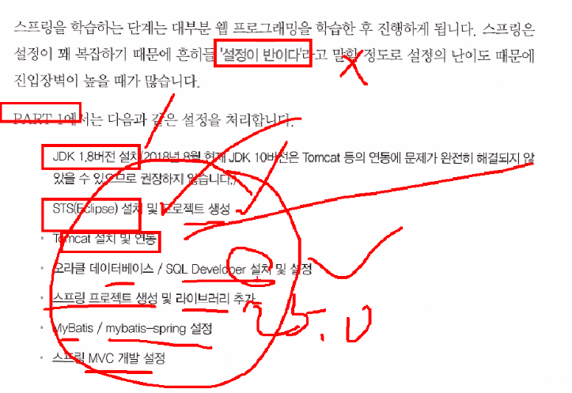
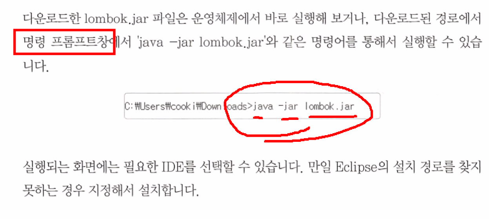
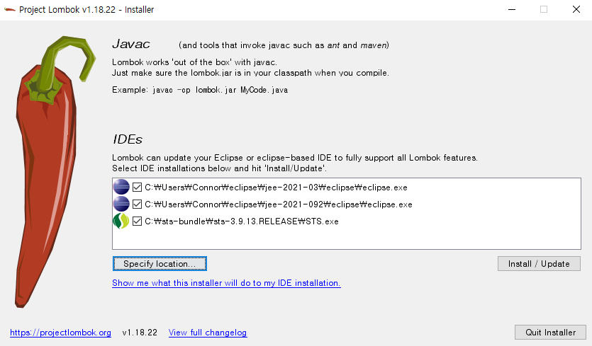
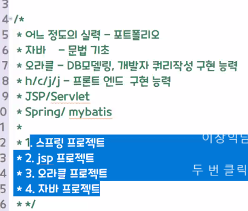

# 1.28

**복습**
문제1) org.doit.web.newlecture.dao 패키지 안에 
           NLNoticeDao.java 파일 삭제 후 에러 발생하면 
           에러 메시지 확인 후 해결.

**NLMemberShipService.java**

```java
@Service
public class NLMemberShipService implements MemberShipService {

	@Autowired
	private SqlSession sqlSession;
	
	@Override
	public void insertAndPointUpOfMember(Notice notice, String id) throws ClassNotFoundException, SQLException {
		NoticeDao mybatisNoticeDao = sqlSession.getMapper(NoticeDao.class);
		
		notice.setWriter(id);
		mybatisNoticeDao.insert(notice);
	}
}
```

이와같이 수정

문제2) NLMemberDao.java 도  mybatis 를 사용해서 수정 후
            NLMemberDao.java 파일 삭제 후 확인

**JoinusController.java**

```java
	@Autowired
	private SqlSession sqlSession;

join() {
		MemberDao mybatisMemberDao = sqlSession.getMapper(MemberDao.class);
		mybatisMemberDao.insert(member);
```


**root-context.xml**

```xml
<value>classpath:org/doit/web/newlecture/dao/mapper/NLMemberDao.xml</value>
```

위 코드 추가.


문제3) mybatis 설정 과정 상세히 적으세요.
          ㄱ. pom.xml: 의존모듈 mybatis, mybatis-spring 추가
          ㄴ. root-context.xml: SqlSessionFactoryBean, SqlSessionTemplate 추가 후 mapperLocations 의 list 에 value 로 xml 경로 지정
          ㄷ. xml: SQL 문 작성
          ㄹ. controller: @autowired 후 CRUD 

문제4) 공지사항 삭제 버튼 클릭시  [경고창] 처리 안됨-> 해결

views/customer/inc/layout.jsp

```jsp
<script src="https://ajax.googleapis.com/ajax/libs/jquery/3.6.0/jquery.min.js"></script>
```

head 태그에 혹은 body 태그의 첫 부분에 위 코드 추가.

> `</script>` 닫기태그를 없애면 에러가 난다.

---

**[DAO 에서 Alias]**

**root-context.xml**

```xml
<bean id="sqlSessionFactory" class="org.mybatis.spring.SqlSessionFactoryBean">
    <property name="dataSource" ref="dataSource"/>
    <property name="mapperLocations">
        <list>
            <value>classpath:org/doit/web/newlecture/dao/mapper/NLNoticeDao.xml</value>
            <value>classpath:org/doit/web/newlecture/dao/mapper/NLMemberDao.xml</value>
        </list>
    </property>

    <!-- 추가 -->
    <property name="typeAliases">
        <list> 
            <value>org.doit.web.newlecture.vo.Member</value>
            <value>org.doit.web.newlecture.vo.Notice</value>
        </list>
    </property>		
</bean>
```

alias 를 사용할 수 있다.

```java
@Alias("Member")
```


```xml
<select id="getMember" resultType="Member">
    SELECT * 
    FROM MEMBER
    WHERE id = #{id}
</select>
```


---

11시 수업

STSMybatis03

p.575 스캔을 이용한 매퍼 검색 + 매퍼 자동 Dao 구현 (어노테이션)

xml 파일이 필요없다.

매퍼파일 (NLNoticeDao.xml) 필요없다.

매퍼 인터페이스 (NoticeDao.java) 만 있으면 된다. 검색해서 자동으로 빈으로 등록 -> 사용


컴포넌트 - 스캔 / 마이바티스 스캔 차이점

`@Controller` 클래스

`@Repository` 클래스

`@Service` 

`@Component` 

마이바이스

매퍼 인터페이스 스캔

1. root-context.xml 수정
2. 매퍼 인터페이스 = 매퍼파일 + 인터페이스
   - NLMemberDao.xml MemberDao.java
3. CustomerController.java 수정
   - JoinusController.java 수정


**root-context.xml**

```xml
<bean id="sqlSessionFactory" class="org.mybatis.spring.SqlSessionFactoryBean">
    <property name="dataSource" ref="dataSource"/>
</bean>

<mybatis-spring:scan base-package="org.doit.web.newlecture.dao"/>
```

모두 지우고 이렇게만 남기고 추가한다.

namespaces 의 mybatis-spring 이 보이지 않으면 pom.xml 에 모듈을 추가한다.

mybatis-spring 체크

**MemberDao.java**

```java
public interface MemberDao {
	
	@Select("SELECT * FROM MEMBER WHERE id = #{id} ")
	Member getMember(String id) throws ClassNotFoundException, SQLException;
	
	@Insert("		INSERT INTO MEMBER " + 
			"		(id, pwd, name, GENDER, BIRTH, IS_LUNAR, CPHONE, EMAIL, HABIT, REGDATE)" + 
			"		VALUES (#{id}, #{pwd}, #{name}, #{gender}, #{birth}, #{is_lunar}, #{cphone}, #{email}, #{habit}, SYSDATE)")
	int insert(Member member) throws ClassNotFoundException, SQLException;
}
```


**NoticeDao.java 전체코드**

```java
public interface NoticeDao {
	
	@Select("		SELECT COUNT(*) CNT " + 
			"		FROM NOTICES " + 
			"		WHERE ${field} LIKE '%${query}%'")
	int getCount(@Param("field") String field, @Param("query") String query) throws ClassNotFoundException, SQLException;
	
	@Select("		SELECT * " + 
			"		FROM (" + 
			"		       SELECT ROWNUM NUM, N.* " + 
			"		       FROM (" + 
			"		              SELECT * " + 
			"		              FROM NOTICES " + 
			"		              WHERE ${param2} LIKE '%${param3}%' " + 
			"				      ORDER BY REGDATE DESC " + 
			"				    ) N" + 
			"			  ) " + 
			"		WHERE NUM BETWEEN 1 + (#{param1}-1)*15 AND 15 + (#{param1}-1)*15")
	List<Notice> getNotices(@Param("page") int page, @Param("field") String field, @Param("query") String query) throws ClassNotFoundException, SQLException;					
	
	@Delete("		DELETE NOTICES " + 
			"		WHERE seq = #{seq}		")
	int delete(@Param("seq") String seq) throws ClassNotFoundException, SQLException;
	
	@Update("		UPDATE NOTICES " + 
			"		SET title = #{title}, CONTENT= #{content}" + 
			"			, FILESRC= #{filesrc} " + 
			"		WHERE seq = #{seq}")
	int update(@Param("notice") Notice notice) throws ClassNotFoundException, SQLException;
	
	@Select("		SELECT * " + 
			"		FROM NOTICES " + 
			"		WHERE SEQ = #{seq} ")
	Notice getNotice(@Param("seq") String seq) throws ClassNotFoundException, SQLException;
	
	@SelectKey(before = true, keyProperty = "seq", resultType = String.class
			, statement = "		SELECT MAX(TO_NUMBER(SEQ))+1 " + 
					"			FROM NOTICES")
	@Insert("		INSERT INTO NOTICES" + 
			"	    ( SEQ, TITLE, CONTENT, WRITER, REGDATE, HIT, FILESRC) " + 
			"	    VALUES ( #{ seq } , #{ title }, #{ content } , #{ writer  }, SYSDATE, 0, #{filesrc, javaType=String,  jdbcType=VARCHAR} )")
	int insert(Notice notice) throws ClassNotFoundException, SQLException;
	
	// 트랜잭션 격리성을 연습하기 위해 메서드 추가.
	@Update("		UPDATE notices " + 
			"		SET hit = hit + 1 " + 
			"		WHERE seq = #{seq}	")
	public void hitUp(@Param("seq") String seq);
	
	@Select("		SELECT hit " + 
			"		FROM notices " + 
			"		WHERE seq = #{seq}")
	public int getHit(@Param("seq") String seq);
}
```

mapper 패키지를 없앤다.


**JoinusController.java**

```java
@Controller
@RequestMapping("/joinus/*")
public class JoinusController {
	
	@Autowired
	MemberDao memberDao;

	// 로그인
	@RequestMapping("login.htm")
	public String login() throws Exception {
//		return "login.jsp";
		return "joinus.login";
	}
	
	@RequestMapping(value = {"join.htm"}, method = RequestMethod.GET)
	public String join() throws Exception {
//		return "join.jsp";
		return "joinus.join";
	}
	
	@RequestMapping(value = {"join.htm"}, method = RequestMethod.POST)
	public String join(Member member) throws Exception {
		memberDao.insert(member);
		return "redirect:../index.htm";
	}
}
```

`SqlSession` 제거 후 `noticeDao` 로 다시 수정한다.


```java
@Controller
@RequestMapping("/customer/*")
public class CustomerController {
	
	@Autowired
	private NoticeDao noticeDao;

	public NoticeDao getNoticeDao() {
		return noticeDao;
	}

	public void setNoticeDao(NoticeDao noticeDao) {
		this.noticeDao = noticeDao;
	}
	
	@Autowired
	private MemberShipService memberShipService;
	

	// 파일 추가
	// download.htm?p=customer/upload&f=a.txt
	   @RequestMapping("download.htm")
	   public void download(
	         @RequestParam("p") String p
	         , @RequestParam("f") String f
	         , HttpServletRequest request
	         , HttpServletResponse response)
	               throws IOException {

	      /*파일 이름에 대한 인코딩 처리 추가*/       
	      String fname =  f; //  new String(f.getBytes("ISO8859_1"), "UTF-8"); // f 
	      response.setHeader("Content-Disposition","attachment;filename="+ new String(fname.getBytes(), "ISO8859_1"));      
	      /*파일 다운로드가 가능하도록 하기 위한 물리적 경로*/
	      String fullPath = request.getSession().getServletContext().getRealPath(   p + "/" + fname);
	      /*파일 다운로드에 대한 처리 과정 추가*/
	      FileInputStream fin = new FileInputStream(fullPath);
	      ServletOutputStream sout = response.getOutputStream(); // 응답 스트림
	      byte[] buf = new byte[1024];
	      int size = 0;
	      while((size = fin.read(buf, 0, 1024)) != -1) {
	         sout.write(buf, 0, size); 
	      }
	      fin.close();
	      sout.close();
	   } // method
	
	
	// 글 삭제
	@RequestMapping("noticeDel.htm")
	public String noticeDel(String seq
			, String oFilesrc
			, HttpServletRequest request
	) throws Exception {
//		if (attachFileName != null) {
			String uploadRealPath = request.getSession().getServletContext().getRealPath("/customer/upload");
			File delOFile = new File(uploadRealPath, oFilesrc);
			
			if (delOFile.exists()) {
				delOFile.delete();
			}
//		}

		// ㄴ. DB 삭제
		noticeDao.delete(seq);
		return "redirect:notice.htm";
	}

	// 글 수정
	@RequestMapping(value = {"noticeEdit.htm"}, method = RequestMethod.GET)
	public String noticeEdit(String seq, Model model) throws Exception {
		Notice notice = noticeDao.getNotice(seq);
		model.addAttribute("notice", notice);
		return "customer.noticeEdit";
	}
	
	@RequestMapping(value = {"noticeEdit.htm"}, method = RequestMethod.POST)
	public String noticeEdit(
			Notice notice
			, @RequestParam("oFilesrc") String oFilesrc // 원래 첨부파일 유무 체크
			, HttpServletRequest request
			) throws Exception {
		String uploadRealPath = request.getSession().getServletContext().getRealPath("/customer/upload");
		CommonsMultipartFile multipartFile = notice.getFile();
		
		if (!multipartFile.isEmpty()) { // 새로 첨부파일 있다면
			// 원래 첨부된 파일이 있다면 삭제.
			File delOFile = new File(uploadRealPath, oFilesrc);
			
			if (delOFile.exists()) {
				delOFile.delete();
			}
			// ㄱ. upload 폴더 - 저장
			System.out.println("> uploadRealPath: " + uploadRealPath);
			String originalFilename = multipartFile.getOriginalFilename(); // a.txt
			originalFilename = getFileNameCheck(uploadRealPath, originalFilename);
			File dest = new File(uploadRealPath, originalFilename);
			multipartFile.transferTo(dest); // 업로드 폴더에 파일 저장.

			// ㄴ. notice.filesrc 업로드된 파일이름 저장: a.txt -> [a-1.txt]
			notice.setFilesrc(originalFilename);
		} else { // 새로 첨부파일 있다면
			notice.setFilesrc(oFilesrc);
		}
		
		int rowCount = noticeDao.update(notice);
		return "redirect:noticeDetail.htm?seq=" + notice.getSeq();
	}

	// 글 작성
	@RequestMapping(value = {"noticeReg.htm"}, method = RequestMethod.GET)
	public String noticeReg() throws Exception {
		// 제목, 내용 + 첨부된 파일 X
		// 1. dao.insert~()
		// 2. 글 목록 notice.htm 요청
		return "customer.noticeReg";
	}
	
	public String getFileNameCheck(String uploadPath 
			, String originalFilename) {   
		int index = 1;
		
		while(true) {
			File f = new File(uploadPath, originalFilename); // 파일객체
			if( !f.exists()) return originalFilename;    
			originalFilename = 
					originalFilename.substring(0, originalFilename.length()-4)
					+" - "
					+ (index++)
					+ originalFilename.substring(originalFilename.length()-4); 
		} // while 문 닫기
	}
	
	@RequestMapping(value = {"noticeReg.htm"}, method = RequestMethod.POST)
	public String noticeReg(
			Notice notice
			, HttpServletRequest request
			, Principal principal
			) throws Exception {
		CommonsMultipartFile multipartFile = notice.getFile();
		String uploadRealPath = null;
		
		// 첨부된 파일 있다면
		if (!multipartFile.isEmpty()) {
			
			// ㄱ. upload 폴더 - 저장
			uploadRealPath = request.getSession().getServletContext().getRealPath("/customer/upload");
			System.out.println("> uploadRealPath: " + uploadRealPath);
			String originalFilename = multipartFile.getOriginalFilename(); // a.txt
			originalFilename = getFileNameCheck(uploadRealPath, originalFilename);
			File dest = new File(uploadRealPath, originalFilename);
			multipartFile.transferTo(dest); // 업로드 폴더에 파일 저장.
			
			// ㄴ. notice.filesrc 업로드된 파일이름 저장: a.txt -> [a-1.txt]
			notice.setFilesrc(originalFilename);
		}
		
		/*
		int rowCount = noticeDao.insert(notice);
		
		if (rowCount == 1) {
			// 스프링에서 리다이렉트 redirect: 접두어 붙이자.
			return "redirect:notice.htm";
		} else {
			return "noticeReg.jsp?error";
		}
		*/
//		noticeDao.insertAndPointUpOfMember(notice, "kk0939");
		// notice.setWriter(principal.getName()); 이 맞다.
		memberShipService.insertAndPointUpOfMember(notice, principal.getName());
		return "redirect:notice.htm";
	}
	
	// 글 목록
	@RequestMapping("notice.htm")
	public String notices(
			@RequestParam(value = "page", defaultValue = "1")int page
			, @RequestParam(value = "field", defaultValue = "title")String field
			, @RequestParam(value = "query", defaultValue = "")String query
			, Model model
			) throws Exception {
		
//		List<Notice> list = this.noticeDao.getNotices(page, field, query);
		List<Notice> list = noticeDao.getNotices(page, field, query);
		
		model.addAttribute("test", "Hello.Spring MVC World!");
		model.addAttribute("list",list);
		
		// 총 레코드 수, 총 페이지 수
		int rowCount = noticeDao.getCount(field, query);
		int pageCount = (int) Math.ceil((double) rowCount / 15);
		model.addAttribute("pageCount", pageCount);
		
//		return "notice.jsp";
		return "customer.notice";
	}

	// 글 보기
	@RequestMapping("noticeDetail.htm")
	public String noticeDetail(
			String seq
			, Model model
			) throws Exception {
		
		// 인증
		noticeDao.hitUp(seq);
		model.addAttribute("test", "Hello.Spring MVC World!");
		Notice notice = noticeDao.getNotice(seq);
		model.addAttribute("notice",notice);
		return "customer.noticeDetail";
	}
}
```

`SqlSession` 제거 후 `noticeDao` 로 다시 수정한다.

```java
@Service
public class NLMemberShipService implements MemberShipService {

	@Autowired
	private NoticeDao noticeDao;
	
	@Override
	public void insertAndPointUpOfMember(Notice notice, String id) throws ClassNotFoundException, SQLException {
		notice.setWriter(id);
		noticeDao.insert(notice);
	}
}
```

11시 47 분 
10분 휴식
12시 에러  파일 확인 해서 에러 처리
"코드로 배우는 스프링 웹 프로젝트 "
Part1 부분 읽어 보기.

**Notice.java**

```java
@Update("		UPDATE NOTICES " + 
        "		SET title = #{notice.title}, CONTENT= #{notice.content}" + 
        "			, FILESRC= #{notice.filesrc} " + 
        "		WHERE seq = #{notice.seq}")
int update(@Param("notice") Notice notice) throws ClassNotFoundException, SQLException;

@SelectKey(before = true, keyProperty = "seq", resultType = String.class
           , statement = "		SELECT MAX(TO_NUMBER(SEQ))+1 " + 
           "			FROM NOTICES")
@Insert("		INSERT INTO NOTICES" + 
        "	    ( SEQ, TITLE, CONTENT, WRITER, REGDATE, HIT, FILESRC) " + 
        "	    VALUES ( #{ seq } , #{ notice.title }, #{ notice.content } , #{ notice.writer  }, SYSDATE, 0"
        + "		, #{notice.filesrc, javaType=String,  jdbcType=VARCHAR} )")
int insert(Notice notice) throws ClassNotFoundException, SQLException;
```

update 는 되는데 insert 는 여전히 에러가 난다.


---

**오후수업**

코드로 배우는 스프링 웹 프로젝트

스프링은 설정이 꽤 복잡해서 설정이 반이다. 설정 난이도가 높아 진입장벽이 높다.



스프링의 버전에 따라 JDK 의 제한이 있다.

- 5.0x 의 경우 JDK 1.8 이상

JDK, 자바홈 설정


30p

**pom.xml**

```xml
<java-version>1.8</java-version>
<org.springframework-version>5.0.7.RELEASE</org.springframework-version>

<plugin>
    <groupId>org.apache.maven.plugins</groupId>
    <artifactId>maven-compiler-plugin</artifactId>
    <version>2.5.1</version>
    <configuration>
        <source>1.8</source>
        <target>1.8</target>
        <compilerArgument>-Xlint:all</compilerArgument>
        <showWarnings>true</showWarnings>
        <showDeprecation>true</showDeprecation>
    </configuration>
</plugin>
```

1.6 을 1.8 로 수정한다.

**[롬복]**

lombok: https://projectlombok.org/

다운로드 - [1.18.22 다운로드](https://projectlombok.org/downloads/lombok.jar) 최신버전 다운로드 (lombok.jar) - 

Project Lombok은 편집기에 자동으로 연결되고 도구를 빌드하여 Java를 멋지게 장식하는 Java 라이브러리입니다.
다른 getter 또는 equals 메서드를 다시 작성하지 마십시오. 하나의 주석으로 클래스에 완전한 기능을 갖춘 빌더가 있고, 로깅 변수를 자동화하는 등의 작업이 가능합니다.


- lombok ? 편집기 (STS, 이클립스)
  - getter, setter


**[롬복 설치]**



```
C:\Users\Connor\Downloads>
```

```
-jar lombok.jar
```



STS 하나만 선택하고 Quit Installer 버튼을 누른다.


STS 가 설치된 경로에 lombok.jar 파일이 추가된 것을 확인할 수 있다.

STS.ini 설정파일에

```
-javaagent:C:\sts-bundle\sts-3.9.13.RELEASE\lombok.jar
```

이 코드가 있는지 확인한다.

STS.exe 바탕화면 바로가기 삭제/생성

ex00 프로젝트 refresh 클릭


help - about STS 3 메뉴 클릭 - 가장  아래에

`Lombok v1.18.22 "Envious Ferret" is installed. https://projectlombok.org/` 있으면

이클립스에서 인식한 것이다.

~p.40


p.51

- spring 4.0버전: REST 방식의 컨트롤러 지원 (ajax 가 쉬워진다.)
- spring 5.0버전: reactor 를 이용한 Reactive 스타일의 개발환경지원

p.56


**pom.xml**

```xml
<!-- Test -->
<dependency>
    <groupId>junit</groupId>
    <artifactId>junit</artifactId>
    <version>4.12</version>
    <scope>test</scope>
</dependency>        

<!-- 추가 -->
<dependency>
    <groupId>org.springframework</groupId>
    <artifactId>spring-test</artifactId>
    <version>${org.springframework-version}</version>
</dependency>        

<dependency>
    <groupId>org.projectlombok</groupId>
    <artifactId>lombok</artifactId>
    <version>1.18.18</version>
    <scope>provided</scope>
</dependency>        
```

스프링 4.0 이상 테스트할 때 4.10 이상이어야 한다.

junit 버전을 4.12 로 변경하고 spring 과 lombok 코드를 추가한다.

org.zerock.sample 패키지 생성

(4) Chef 클래스

- Restaurant 클래스


```java
@Component
@Data
public class Chef {
	private String name;
```

`@Data` getter, setter, toString 함수를 만들어준다.

`@AllArgsConstructor` 생성자 선언

`@ToString` 

`@getter`

`@setter` 

```java
@Setter(onMethod_ = @Autowired)
private Chef chef;
```

`@autowired` 를 setter 에 추가한다.

자동주입을 할 때에는 언더라인 `_` 을 붙여야 한다. JDK 1.8 버전. JDK 1.7까지는 다르게 한다.

p.65


setter 속성

- `value`
- `onMethod` 
- `onParam`


**root-context.xml**

```xml
<context:component-scan base-package="org.zerock.sample"/>
```

context 추가

p.60

**SampleTests.java**

src.test.java.org.zerock.sample.SampleTests.java

```java
@RunWith(SpringJUnit4ClassRunner.class)
@ContextConfiguration("file:src/main/webapp/WEB-INF/spring/root-context.xml")
@Log4j
public class SampleTests {
	@Setter(onMethod_ = {@Autowired})
	private Restaurant restaurant;
	
	@Test
	public void testExist() {
		assertNotNull(restaurant);
		
		log.info(restaurant);
		log.info("----------------------");
		log.info(restaurant.getChef());
	}
}
```

run as - junit test 


front controller

WebApplicationContext 스프링 컨테이너 가동


p.68

```java
import lombok.NonNull
```


new - junit test case

**HotelTests.java**

```java
@RunWith(SpringJUnit4ClassRunner.class)
@ContextConfiguration("file:src/main/webapp/WEB-INF/spring/root-context.xml")
@Log4j
public class HotelTests {
	
	@Setter(onMethod_ = {@Autowired})
	private SampleHotel hotel;

	@Test
	public void testExist() {
		assertNotNull(hotel);
		
		log.info(hotel);
		log.info("----------------------");
		log.info(hotel.getChef());
	}
}
```

`@Log4j` log.info 메서드를 사용하기 위해 Log4j 어노테이션이 필요하다.

(5) book_ex / book_ex

scott/tiger

**[오라클 포트번호 변경]**

오라클 8080 과 톰캣 8080 로 포트번호가 충돌한다.

```sql
EXEC dbms_xdb.sethttpPort(9090);
```

책에는 오라클의 포트번호를 바꾼다.

(6) 현재 프로젝트에서 ojdbc6.jar 참조

로컬저장소: ojdbc6.jar 등록 mvn


**[ojdbc6]**


프로젝트 우클릭 - properties

Java Build Path: ojdbc6.jar 파일을 추가한다.

Web Deployment Assembly: Java Build Path Entries 에 ojdbc6.jar 추가


(7) org.zerock.persistence.JDBCTests 테스트 클래스 추가


**[3.4 커넥션 풀 설정]**

p.83

**pom.xml**

```xml
<dependency>
    <groupId>com.zaxxer</groupId>
    <artifactId>HikariCP</artifactId>
    <version>4.0.2</version>
</dependency>   
```

책은 2.7.4 로 되어있다.

**root-context.xml**

p.84

```xml
<bean id="hikariConfig" class="com.zaxxer.hikari.HikariConfig">
    <property name="driverClassName" value="oracle.jdbc.driver.OracleDriver"></property>
    <property name="jdbcUrl" value="jdbc:log4jdbc:oracle:thin:@localhost:1521:xe"></property>
    <property name="username" value="scott"></property>
    <property name="password" value="tiger"></property>
</bean>
<bean id="dataSource" class="com.zaxxer.hikari.HikariDataSource" destroy-method="close">
    <constructor-arg ref="hikariConfig"></constructor-arg>
</bean>	
```


p.87

```java
import javax.sql.DataSource;

@RunWith(SpringJUnit4ClassRunner.class)
@ContextConfiguration("file:src/main/webapp/WEB-INF/spring/root-context.xml")
@Log4j
public class DataSourceTests {
	
	@Setter(onMethod_ = {@Autowired})
	private DataSource dataSource;

	@Test
	public void testConnection() {
		try (Connection con = dataSource.getConnection()) {
			log.info(con);
		} catch (Exception e) {
			fail(e.getMessage());
		}
	}
}
```


(8) mybatis + 스프링 연동

p.89 ~ p.105 

명절끝나고 part 2 나감

# 2.3

Part2 종료 - 스프링 프로젝트 진행 / 자소 포폴 등등

Part3 - 스프링 프로젝트 진행

AWS - 스프링 프로젝트 진행

2/11(금) - 스프링 프로젝트 발표

**복습**

mybatis

  ㄱ. pom.xml: 의존모듈 mybatis, mybatis-spring 추가
  ㄴ. root-context.xml: sqlSessionFactory 빈 생성, mybatis-spring:scan 추가
  ㄷ. DAO 인터페이스: SQL 문 작성
  ㄹ. controller: DAO 에 @autowired


롬복
1. 명령 프롬프트에서 롬복 실행
3. pom.xml 에 롬복 추가

**인코딩**

```jsp
<%@ page contentType="text/html; charset=UTF-8" pageEncoding="UTF-8"%>
```


> xml 로 매퍼파일을 분리하는게 유지보수에 더 좋다.


---

**Part 2.**

p.107

- 생성과 동작
- 구조이해와 다양한 예제
- 파일 업로드 처리
- 예외 처리

## Part 02.

**[프로젝트 ex01]**

**pom.xml**

1. springframework-version 5.0.7
2. spring-test, lombok 추가
3. maven-compiler 1.8 변경 후 maven - update project

서버 더블클릭 - modules 탭 - context path 를 `/` 로 수정

코드로 배우는 스프링 웹 프로젝트 p.125

**pom.xml**

```xml
<dependency>
    <groupId>log4j</groupId>
    <artifactId>log4j</artifactId>
    <version>1.2.17</version>
</dependency>		
```


**SampleController.java**

```java
@Controller
@RequestMapping("/sample/*")
@Log4j
public class SampleController {
	private static final Logger logger = LoggerFactory.getLogger(SampleController.class);
	
	@RequestMapping("")
	public void basic() {
		log.info("> basic.......");
	}
}
```

`return "sample"` 이 없어도 `sample.jsp` 를 호출한다.


**SampleController.java**

```java
@GetMapping("/sample/basicGet")
public void basicGet() {
    log.info("> basic get.......");
}
```

`@GetMapping` spring 4.0 에서 추가되었다.


```java
@GetMapping("/sample/ex01")
public String ex01(String name, @RequestParam("age") int age) {
    log.info(">ex01 get......" + name);
    log.info(">ex01 get......" + age);
    return "ex01";
}
```

```
INFO : org.zerock.controller.SampleController - >ex01 get......hong
INFO : org.zerock.controller.SampleController - >ex01 get......20
```


`"/ex01"` 쌤은 이렇게만 매핑해도 작동한다.

`@RequestParam` 이 필요가 없다.

```java
@GetMapping("/sample/ex01")
public String ex01(SampleDTO dto) {
    log.info(">ex01 get......" + dto);
    return "ex01";
}
```

```
INFO : org.zerock.controller.SampleController - >ex01 get......SampleDTO(name=hong, age=20)
```


**[동일한 이름으로 여러개의 파라미터]**

```java
@GetMapping("/ex02Array")
public void ex02Array(@RequestParam("ids") ArrayList<String> ids) {
    log.info("> ex02Array....." + ids);
}
```

```
INFO : org.zerock.controller.SampleController - > ex02Array.....[111, 222, 444]
```


```java
@GetMapping("/ex02Array")
public void ex02Array(String[] ids) {
    log.info("> ex02Array....." + Arrays.toString(ids));
}
```

```
INFO : org.zerock.controller.SampleController - > ex02Array.....[111, 444]
```

`@RequestParam` 가 없어도 된다.

**SampleController.java**

```java
@Controller
@RequestMapping("/sample/*")
@Log4j
public class SampleController {
	private static final Logger logger = LoggerFactory.getLogger(SampleController.class);
	
	@RequestMapping("")
	public void basic() {
		log.info("> basic.......");
	}
	
	@GetMapping("/basicGet")
	public void basicGet() {
		log.info("> basic get.......");
	}
	
	@GetMapping("/ex01")
	public String ex01(SampleDTO dto) {
		log.info(">ex01 get......" + dto);
		return "ex01";
	}
	
	@GetMapping("/ex02Array")
	public void ex02Array(String[] ids) {
		log.info("> ex02Array....." + Arrays.toString(ids));
	}	
}
```

**home.jsp**

```jsp
<form action="/sample/ex02Array">
    <input type="checkbox" name="ids" value="111" checked>111<br>
    <input type="checkbox" name="ids" value="222" checked>222<br>
    <input type="checkbox" name="ids" value="333" checked>333<br>
    <input type="checkbox" name="ids" value="444" checked>444<br>
    <input type="submit">
</form>
```


p.132

```
INFO : org.zerock.controller.SampleController - > ex02Bean.....SampleDTOList(list=[SampleDTO(name=hong, age=20), SampleDTO(name=admin, age=40)])
```

**home.jsp**

```jsp
<form action="/sample/ex02Bean">
    <input type="text" name="list[0].name" value="hong"><br>
    <input type="text" name="list[0].age" value="20"><br>
    <input type="text" name="list[1].name" value="admin"><br>
    <input type="text" name="list[1].age" value="40"><br>
    <input type="submit">
</form>
```


**SampleDTOList.java**

```java
@Data
public class SampleDTOList {
	private List<SampleDTO> list;

	public SampleDTOList() {
		list = new ArrayList<SampleDTO>();
	}
}
```

**SampleController.java**

```java
@GetMapping("/ex02Bean")
public void ex02Bean(SampleDTOList list) {
    log.info("> ex02Bean....." + list);
}
```


p.134

**home.jsp**

```jsp
<form action="/sample/ex03">
    <input type="text" name="title" value="title"><br>
    <input type="date" name="dueDate" value="20"><br>
    <input type="submit">
</form>
```


**오류**

```
INFO : org.zerock.controller.HomeController - Welcome home! The client locale is ko_KR.
```

400번 오류

해결: SampleController.java 에 `@InitBinder` 어노테이션과 함수를 하나 추가한다.

혹은 어노테이션 `DateTimeFormat` 를 사용한다.

p.136

`@InitBinder` 변환이 가능한 데이터는 자동으로 변환되지만 안되는 것도 있다.

파라미터로 넘어오는 날짜는 문자열이므로 날짜로 바꾸기 위해 어노테이션이 필요하다.


```
INFO : org.zerock.controller.SampleController - > ex03....TodoDTO(title=title, dueDate=Mon Feb 14 00:00:00 KST 2022)
```


**SampleController.java**

```java
@InitBinder
public void InitBinder(WebDataBinder binder) {
    SimpleDateFormat dateFormat = new SimpleDateFormat("yyyy-MM-dd");
    binder.registerCustomEditor(java.util.Date.class, new CustomDateEditor(dateFormat, false));
}
```

혹은

**TodoDTO.java**

```java
@DateTimeFormat(pattern = "yyyy-MM-dd")
private Date dueDate;
```


p.139

6.6 


스프링: https://hyunipad.tistory.com/57


```java
@GetMapping("/ex04")
public String ex04(SampleDTO dto, @ModelAttribute("page") int page) {
    log.info("> ex04...." + dto + "/" + page);
    return "/sample/ex04";
}
```

**ex04.jsp**

```jsp
> page: ${param.page } <br>
> page: ${page } <br>
```


**[RedirectAttributes]**

p.143 +++

+++ 6.4.2 RedirectAttributes

컨트롤러 메서드 -> 뷰 (??.jsp)

Model model

model.addAttribute("page", page)

리다이렉트

`redirect:` 접두어

JSP/Servlet 리다이렉트

`response.sendRedirect("/home?name=hong&age=20")` 

**일회성**

`RedirectAttribute rttr` 

`rttr.addFlashAttribute("name", "hong")`

`rttr.addFlashAttribute("age", 20)`

스프링 MVC 에서 리다이렉트 할 때 일회성 파라미터 값을 설정하는 객체

p.143

**[Controller 의 리턴타입]**

- `String` jsp 를 이용하는 경우 jsp 파의 경로와 파일이름을 나타내기 위해 사용
- `void` 호출한 URL 과 동일한 이름의 jsp 를 의미
- `VO` `DTO` JSON 타입의 데이터를 만들어서 반환하는 용도
- `ResponseEntity`
- `Model` `ModelAndView`
- `HttpHeaders` 


6.5.3 객체타입

p.147 jackson-databind

```
{"name":"hong","age":20}
```


**JSON 자동연결: pom.xml**

```xml
<dependency>
    <groupId>com.fasterxml.jackson.core</groupId>
    <artifactId>jackson-databind</artifactId>
    <version>2.12.1</version>
</dependency>		
```

**SampleController.java**

```java
@GetMapping("/ex05")
public @ResponseBody SampleDTO ex05() {
    log.info("> ex05.....");
    SampleDTO dto = new SampleDTO();
    dto.setName("hong");
    dto.setAge(20);
    return dto;
}
```

`@ResponseBody` 

p.148 타이핑


오후수업


```java
@GetMapping("/ex06")
public ResponseEntity<String> ex06() {
    log.info("> ex06.....");
    String body = "{\"name\":\"홍길동\"}";
    HttpHeaders headers = new HttpHeaders();
    headers.add("Content-Type", "application/json;charset=UTF-8");
    return new ResponseEntity<String>(body, headers, HttpStatus.OK);
}
```


**[파일업로드]**

```
INFO : org.zerock.controller.SampleController - ----------
INFO : org.zerock.controller.SampleController - name: 정보처리기사20210814(교사용).hwp
INFO : org.zerock.controller.SampleController - size: 148480
INFO : org.zerock.controller.SampleController - ----------
INFO : org.zerock.controller.SampleController - name: 정보처리기사20210814(학생용) (1).hwp
INFO : org.zerock.controller.SampleController - size: 147968
INFO : org.zerock.controller.SampleController - ----------
INFO : org.zerock.controller.SampleController - name: tiles-2.2.2-bin.zip
INFO : org.zerock.controller.SampleController - size: 5916906
INFO : org.zerock.controller.SampleController - ----------
INFO : org.zerock.controller.SampleController - name: 정보처리기사20210814(학생용).hwp
INFO : org.zerock.controller.SampleController - size: 147968
```


**pom.xml**

```xml
<dependency>
    <groupId>commons-fileupload</groupId>
    <artifactId>commons-fileupload</artifactId>
    <version>1.4</version>
</dependency>		
```


```java
@GetMapping("/exUpload")
public void exUpload() {
    log.info("> exUpload.....");
}
```

**servlet-context.xml**

```xml
<beans:bean id="multipartResolver" class="org.springframework.web.multipart.commons.CommonsMultipartResolver">
    <beans:property name="defaultEncoding" value="UTF-8"></beans:property>
    <beans:property name="maxUploadSize" value="104857560"></beans:property>
    <beans:property name="maxUploadSizePerFile" value="2097152"></beans:property>
    <beans:property name="uploadTempDir" value="file:/C:/upload/tmp"></beans:property>
    <beans:property name="maxInMemorySize" value="10485756"></beans:property>
</beans:bean>
```

**exUpload.jsp**

```jsp
<form action="/sample/exUploadPost" method="post" enctype="multipart/form-data">
    <div><input type="file" name="files" multiple></div>
    <div><input type="submit"></div>
</form>
```


**Controller.java**

```java
@PostMapping("/exUploadPost")
public void exUploadPost(ArrayList<MultipartFile> files) {
    files.forEach(file -> {
        log.info("----------");
        log.info("name: " + file.getOriginalFilename());
        log.info("size: " + file.getSize());
    });
}
```

`commons-io` 파일수정 ? 

1. pom.xml 에 fileupload 와 io 추가


**[6.6 Controller 의 Exception 처리]**

p.154

- `@ExceptionHandler` `@ControllerAdvice` 를 이용한 처리
- `@ResponseEntity` 를 이용하는 예외 메시지 구성

공통적인 예외사항에 대해서 별도로 `@ControllerAdvice` 를 이용해서 분리하는 방식이다.


**CommonExceptionAdvice.java**

```java
@ControllerAdvice
@Log4j
public class CommonExceptionAdvice {

    @ExceptionHandler(Exception.class)
    public String except(Exception ex, Model model) {
        log.error("Exception..... " + ex.getMessage());
        model.addAttribute("exception", ex);
        log.error(model);
        return "error _page";
    }
}
```

`@ControllerAdvice`  자동스캔 + 예외처리 (AOP 방식). 컨트롤러 이면서 예외처리

`@ExceptionHandler` 컨트롤러에서 발생하는 Exception 모든 예외를 처리하는 메서드

**servlet-context.xml**

```xml
<context:component-scan base-package="org.zerock.exception" />
```


**error_page.jsp**

```
org.springframework.validation.BeanPropertyBindingResult: 1 errors Field error in object 'sampleDTO' on field 'age': rejected value [test]; codes [typeMismatch.sampleDTO.age,typeMismatch.age,typeMismatch.int,typeMismatch]; arguments [org.springframework.context.support.DefaultMessageSourceResolvable: codes [sampleDTO.age,age]; arguments []; default message [age]]; default message [Failed to convert property value of type 'java.lang.String' to required type 'int' for property 'age'; nested exception is java.lang.NumberFormatException: For input string: "test"]
org.springframework.web.method.annotation.ModelAttributeMethodProcessor.resolveArgument(ModelAttributeMethodProcessor.java:157)
org.springframework.web.method.support.HandlerMethodArgumentResolverComposite.resolveArgument(HandlerMethodArgumentResolverComposite.java:124)
org.springframework.web.method.support.InvocableHandlerMethod.getMethodArgumentValues(InvocableHandlerMethod.java:161)
org.springframework.web.method.support.InvocableHandlerMethod.invokeForRequest(InvocableHandlerMethod.java:131)
org.springframework.web.servlet.mvc.method.annotation.ServletInvocableHandlerMethod.invokeAndHandle(ServletInvocableHandlerMethod.java:102)
org.springframework.web.servlet.mvc.method.annotation.RequestMappingHandlerAdapter.invokeHandlerMethod(RequestMappingHandlerAdapter.java:877)
org.springframework.web.servlet.mvc.method.annotation.RequestMappingHandlerAdapter.handleInternal(RequestMappingHandlerAdapter.java:783)
org.springframework.web.servlet.mvc.method.AbstractHandlerMethodAdapter.handle(AbstractHandlerMethodAdapter.java:87)
org.springframework.web.servlet.DispatcherServlet.doDispatch(DispatcherServlet.java:991)
org.springframework.web.servlet.DispatcherServlet.doService(DispatcherServlet.java:925)
org.springframework.web.servlet.FrameworkServlet.processRequest(FrameworkServlet.java:974)
org.springframework.web.servlet.FrameworkServlet.doGet(FrameworkServlet.java:866)
javax.servlet.http.HttpServlet.service(HttpServlet.java:655)
org.springframework.web.servlet.FrameworkServlet.service(FrameworkServlet.java:851)
javax.servlet.http.HttpServlet.service(HttpServlet.java:764)
org.apache.catalina.core.ApplicationFilterChain.internalDoFilter(ApplicationFilterChain.java:231)
org.apache.catalina.core.ApplicationFilterChain.doFilter(ApplicationFilterChain.java:166)
org.apache.tomcat.websocket.server.WsFilter.doFilter(WsFilter.java:52)
org.apache.catalina.core.ApplicationFilterChain.internalDoFilter(ApplicationFilterChain.java:193)
org.apache.catalina.core.ApplicationFilterChain.doFilter(ApplicationFilterChain.java:166)
org.apache.catalina.core.StandardWrapperValve.invoke(StandardWrapperValve.java:196)
org.apache.catalina.core.StandardContextValve.invoke(StandardContextValve.java:97)
org.apache.catalina.authenticator.AuthenticatorBase.invoke(AuthenticatorBase.java:542)
org.apache.catalina.core.StandardHostValve.invoke(StandardHostValve.java:135)
org.apache.catalina.valves.ErrorReportValve.invoke(ErrorReportValve.java:81)
org.apache.catalina.valves.AbstractAccessLogValve.invoke(AbstractAccessLogValve.java:698)
org.apache.catalina.core.StandardEngineValve.invoke(StandardEngineValve.java:78)
org.apache.catalina.connector.CoyoteAdapter.service(CoyoteAdapter.java:364)
org.apache.coyote.http11.Http11Processor.service(Http11Processor.java:624)
org.apache.coyote.AbstractProcessorLight.process(AbstractProcessorLight.java:65)
org.apache.coyote.AbstractProtocol$ConnectionHandler.process(AbstractProtocol.java:831)
org.apache.tomcat.util.net.NioEndpoint$SocketProcessor.doRun(NioEndpoint.java:1673)
org.apache.tomcat.util.net.SocketProcessorBase.run(SocketProcessorBase.java:49)
org.apache.tomcat.util.threads.ThreadPoolExecutor.runWorker(ThreadPoolExecutor.java:1191)
org.apache.tomcat.util.threads.ThreadPoolExecutor$Worker.run(ThreadPoolExecutor.java:659)
org.apache.tomcat.util.threads.TaskThread$WrappingRunnable.run(TaskThread.java:61)
java.lang.Thread.run(Unknown Source)
```


```jsp
<h4> <c:out value="${exception.getMesssage() }"></c:out> </h4>

<ul>
    <c:forEach items="${exception.getStackTrace() }" var="stack">
        <li><c:out value="${stack }"></c:out></li>
    </c:forEach>
</ul>
```


**[p.158 6.6.2 404 에러 페이지]**

404 와 500 에러코드가 대부분이다.

500 메시지는 Internal Server Error 이므로 `@ExceptionHandler` 를 이용하면 된다.

서블릿이나 JSP 를 이용해 개발할 때는 별도의 에러페이지를 web.xml 에 지정했었다.

스프링에서는 WAS 내부에서 발생하는 에러를 


**web.xml**

```xml
<servlet>
    <servlet-name>appServlet</servlet-name>
    <servlet-class>org.springframework.web.servlet.DispatcherServlet</servlet-class>
    <init-param>
        <param-name>contextConfigLocation</param-name>
        <param-value>/WEB-INF/spring/appServlet/servlet-context.xml</param-value>
    </init-param>

    <!-- 추가: p.159 요청 URL 없을경우 404 -->
    <init-param>
        <param-name>throwExceptionIfNoHandlerFound</param-name>
        <param-value>true</param-value>
    </init-param>

    <load-on-startup>1</load-on-startup>
</servlet>
```


```java
@ControllerAdvice
@Log4j
public class CommonExceptionAdvice {

    @ExceptionHandler(Exception.class)
    public String except(Exception ex, Model model) {
        log.error("Exception..... " + ex.getMessage());
        model.addAttribute("exception", ex);
        log.error(model);
        return "/error/error_page";
    }

    // 추가
    @ExceptionHandler(NoHandlerFoundException.class)
    @ResponseStatus(HttpStatus.NOT_FOUND)
    public String handle404(NoHandlerFoundException ex) {
        return "custom404";
    }
}
```



# 2.4

Part 3. 163p

스프링 MVC 와 MyBatis 를 이용해서 기본적인 CRUD 와 페이징 처리, 검색기능의 게시물 관리를 만들어보려고 한다.

일반적으로 웹 프로젝트는 3-tier (티어) 방식으로 구성합니다.

- presentation tier: 
- Business Tier: 
- Persistence Tier: 

**Naming Convention**

- `config`
- `controller`
- `service`
- `domain`
- `persistence`
- `exception`
- `aop`
- `security`
- `util` 

7.2.1 요구사항에 따른 화면설계

## Part 03.

**ex02**

1. 스프링 버전
2. 메이븐 버전
3. 테스트 버전


```sql
CREATE SEQUENCE seq_board;

  CREATE TABLE "SCOTT"."TBL_BOARD" 
   (   "BNO" NUMBER(10,0), 
    "TITLE" VARCHAR2(200 BYTE) NOT NULL ENABLE, 
    "CONTENT" VARCHAR2(2000 BYTE) NOT NULL ENABLE, 
    "WRITER" VARCHAR2(50 BYTE) NOT NULL ENABLE, 
    "REGDATE" DATE DEFAULT sysdate, 
    "UPDATEDATE" DATE DEFAULT sysdate, 
    CONSTRAINT "PK_BOARD" PRIMARY KEY ("BNO")
    USING INDEX PCTFREE 10 INITRANS 2 MAXTRANS 255 COMPUTE STATISTICS 
    STORAGE(INITIAL 65536 NEXT 1048576 MINEXTENTS 1 MAXEXTENTS 2147483645
            PCTINCREASE 0 FREELISTS 1 FREELIST GROUPS 1 BUFFER_POOL DEFAULT FLASH_CACHE DEFAULT CELL_FLASH_CACHE DEFAULT)
    TABLESPACE "USERS"  ENABLE
   ) SEGMENT CREATION IMMEDIATE 
  PCTFREE 10 PCTUSED 40 INITRANS 1 MAXTRANS 255 NOCOMPRESS LOGGING
  STORAGE(INITIAL 65536 NEXT 1048576 MINEXTENTS 1 MAXEXTENTS 2147483645
          PCTINCREASE 0 FREELISTS 1 FREELIST GROUPS 1 BUFFER_POOL DEFAULT FLASH_CACHE DEFAULT CELL_FLASH_CACHE DEFAULT)
  TABLESPACE "USERS" ;
  
INSERT INTO tbl_board (bno, title, content, writer)
  VALUES (seq_board.nextval, '테스트 제목', '테스트 내용', 'user00');COMMIT;  
```


9:37 log4jdbc.properties?

**[CRUD 구현]**

182p

해결: build path junit 4 추가

scope 주석


```xml
<?xml version="1.0" encoding="UTF-8"?>
<!DOCTYPE mapper
  PUBLIC "-//mybatis.org//DTD Mapper 3.0//EN"
  "http://mybatis.org/dtd/mybatis-3-mapper.dtd">
<mapper namespace="org.zerock.mapper.BoardMapper">

   <select id="getList" resultType="org.zerock.domain.BoardVO">
      <![CDATA[
      select * from tbl_board where bno > 0 
      ]]>
   </select>
    
</mapper>
```


10:24 소스 다운받기

p.193

testGetList 메서드 에러나는 듯

**[delete]**

8.2.3 p.194

삭제가 잘 된다.

3 티어 (tier)

1. 화면
2. 로직 (서비스) 계층
3. DB 연동 계층 - 작업완료 BoardMapper 인터페이스, XML 파일 + 단위테스트


**[Chapter 09 비즈니스 계층]**

198p

spring 4.3 이상에서는 자동처리 p200

`private BoardMapper mapper`


(6) 로직 (서비스) 계층 [Chapter 9] 

- BoardService 인터페이스
- BoardServiceImpl 클래스 구현
- 단위테스트 X


(7) 

```
net.sf.log4jdbc.sql.jdbcapi.DriverSpy
```


**list.jsp**

```jsp
<script>
   $(document).ready(function(){
      var result = '<c:out value="${result}"/>';
      
      checkModal(result);
      
      // p.257
      history.replaceState({}, null, null);
      
      function checkModal(result){
         if(result === '' || history.state) return;
         if( parseInt(result)>0 ) alert("게시글 " + parseInt(result) +" 번이 등록되었습니다. "); 
      }
   });
</script>
```


`history.state` 새로고침하면 더이상 넘어오지 않는다.


p.245

p.251

**인코딩: web.xml p.243**

```xml
<filter>
    <filter-name>encodingFilter</filter-name>
    <filter-class>org.springframework.web.filter.CharacterEncodingFilter</filter-class>
    <init-param>
        <param-name>encoding</param-name>
        <param-value>UTF-8</param-value>
    </init-param>
</filter>
<filter-mapping>
    <filter-name>encodingFilter</filter-name>
    <!-- <url-pattern>/*</url-pattern> -->
    <servlet-name>appServlet</servlet-name>
</filter-mapping>
```


p.262

히창

```
=================
형형 만약에 괜춘한 회사 가고 싶으면

-코테 (는 당연한거고)
- 만약 서버 개발자 가고 싶으면  
 1. 인덱스 다뤄보던지
 2. 로그인 처리 여러개 연동해서 분할 어뜨케 했는지
 3. 암호화 어떤식으로 처리했는지
 4.  디비 쿼리 작성해서 돌렸는데 , 이걸 , 어떤 식으로 쿼리 튜닝해서 이런식으로 속도를 빠르게 해보았다 라던지
 5. 쨌든 서버 쪽은, 속도, 성능 만 생각하면 됨
 6. 좀 더 할 수 있으면 쿠버네틱스 사용 해보았는지
6. 캐쉬 어떤 식으로 사용했다라는지
```


**button 속성**

- `data-oper` 

```jsp
     <button type="submit" data-oper='modify' class="btn btn-default">Modify</button>
     <button type="submit" data-oper='remove' class="btn btn-danger">Remove</button>
     <button type="submit" data-oper='list' class="btn btn-info">List</button>
     
   </form>


   </div> 

<script src="https://ajax.googleapis.com/ajax/libs/jquery/3.5.1/jquery.min.js"></script>
<script>
   $(document).ready(function(){
       var formObj = $("form");

        $('button').on("click", function(e){
          
          e.preventDefault(); 
          
          var operation = $(this).data("oper");
          
          console.log(operation);
          
          if(operation === 'remove'){
            formObj.attr("action", "/board/remove");
            
          }else if(operation === 'list'){
            //move to list
            formObj.attr("action", "/board/list").attr("method","get");
            
            var pageNumTag = $("input[name='pageNum']").clone();
            var amountTag = $("input[name='amount']").clone();
            var keywordTag = $("input[name='keyword']").clone();
            var typeTag = $("input[name='type']").clone();      
            
            formObj.empty();
            
            formObj.append(pageNumTag);
            formObj.append(amountTag);
            formObj.append(keywordTag);
            formObj.append(typeTag);          
          }
          
          formObj.submit();
        });
   });
</script>
```

(8) CRUD 작업 완료 ~~~

**(9) Chapter 12 [p.268 페이징 처리~]**

p.292 Chapter 13

Chapter 13 / 14 / 15 읽기

p.268

12.1 order by 의 문제


**[SQL Developer]**

F10: 실행계획

**OPTIONS**

- `FULL`
- `BY INDEX ROWID` 인덱스를 이용하면 정렬을 생략할 수 있다.

12.2 order by 보다는 인덱스

p.274 

**힌트**

```sql
SELECT 
/*+ INDEX_DESC(tbl_board pk_board) */ 
*
FROM TBL_BOARD;
```

> `*` 과 `+` 사이 공백이 있으면 안된다.

Chapter 13.

p.292

- `pageNum` 현재페이지
- `amount` 한페이지에 출력할 게시글 수


**BoardMapper.xml**

```xml
<select id="getListWithPaging" resultType="org.zerock.domain.BoardVO"> 
    <![CDATA[ 
  select 
   bno, title, content, writer, regdate, updatedate 
  from ( 
   select /*+INDEX_DESC(tbl_board pk_board) */ 
    rownum rn, bno, title, content, writer, regdate, updatedate 
   from tbl_board 
   where rownum <= #{pageNum} * #{amount} 
   ) 
  where rn > (#{pageNum} -1) * #{amount} 
 ]]> 
</select>
```

[**Chapter 14 페이징화면 처리]**

p.302

14.1 페이징 처리할 때 필요한 정보들

- 현재 페이지 번호
- 이전과 다음으로 이동 가능한 링크의 표시 여부
- 화면에서 보여지는 페이지의 시작번호와 끝 번호 (startPage, endPage)


p.308

**페이징처리: list.jsp**

```jsp
<!-- p 308 -->
<div class='pull-right'>
    <ul class="pagination"> 
        <c:if test="${pageMaker.prev}">
            <li class="paginate_button previous"><a href="#">Previous</a>
            </li>
        </c:if> 
        <c:forEach var="num" begin="${pageMaker.startPage}"
                   end="${pageMaker.endPage}">
            <li class="paginate_button"><a href="#">${num}</a></li>
        </c:forEach>
        <c:if test="${pageMaker.next}">
            <li class="paginate_button next"><a href="#">Next</a></li>
        </c:if>  
    </ul>
</div>
<!--  end Pagination -->   
```


14.3 JSP 에서 페이지 번호 출력

p.309

**[14.4 조회 페이지로 이동]**

p.313

