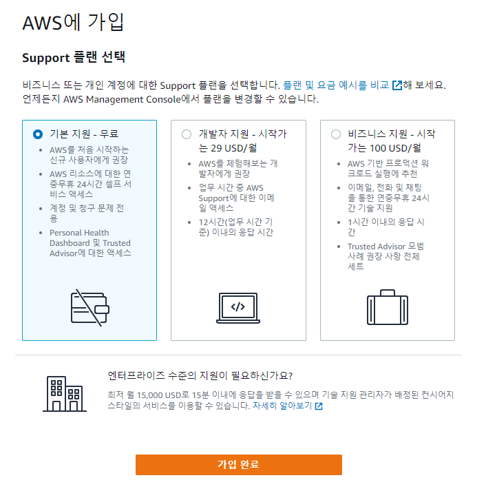
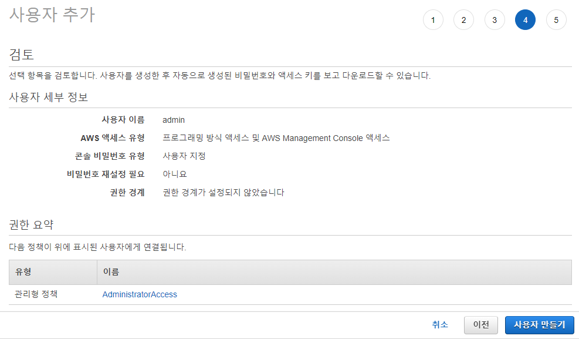
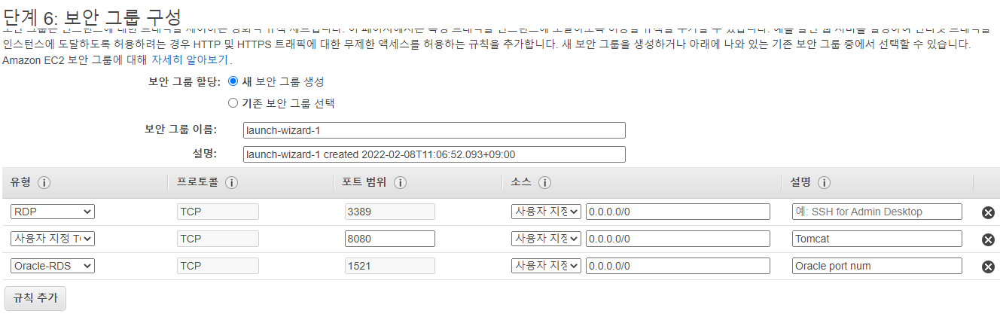
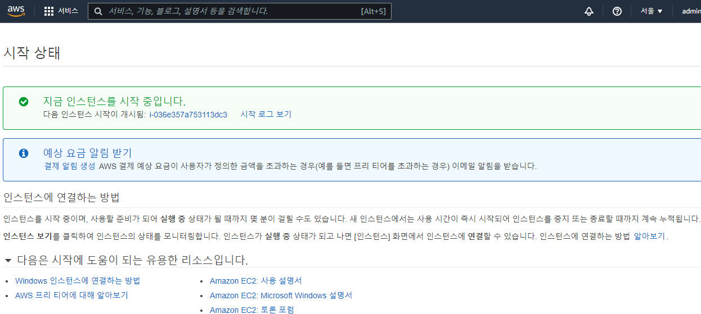
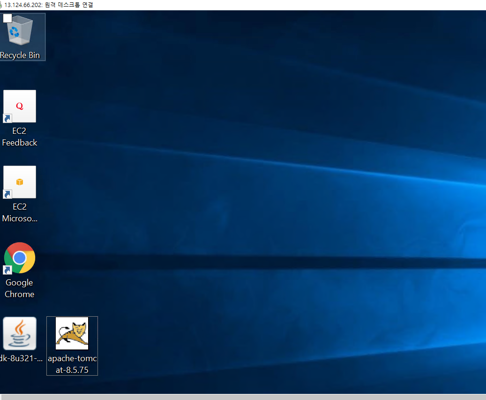
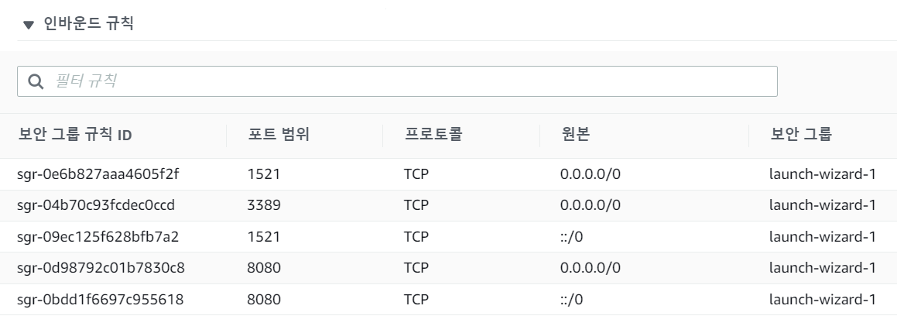
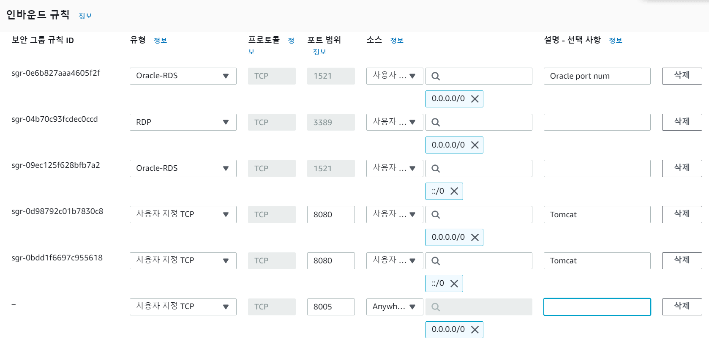

# 2.7

**[AWS]**

AWS: https://aws.amazon.com/ko/

학습하기 - AWS 소개 클릭 - 

1. AWS 를 통한 클라우드 컴퓨팅 
   - Amazon Web Services(AWS)
   - 전 세계적으로 분포한 데이터 센터에서 200개가 넘는 완벽한 기능의 서비스를 제공하는, 세계적으로 가장 포괄적이며, 널리 채택되고 있는 클라우드 플랫폼입니다.
   - 빠르게 성장하는 스타트업, 가장 큰 규모의 엔터프라이즈, 주요 정부 기관을 포함하여 수백만 명의 고객이 AWS를 사용하여 비용을 절감하고, 민첩성을 향상시키고 더 빠르게 혁신하고 있습니다.
   - 더 많은 기능 제공
     1. AWS는 컴퓨팅, 스토리지, 데이터베이스와 같은 인프라 기술부터 기계 학습 및 인공 지능, 데이터 레이크 및 분석, 사물 인터넷 등의 새로운 기술까지 다른 클라우드 공급자보다 훨씬 더 많은 [서비스](https://aws.amazon.com/ko/products/?pg=WIAWS-mstf)와 서비스 내 기능을 제공합니다.
     2. 이를 통해 더 빠르고, 쉽고, 경제적으로 기존 애플리케이션을 클라우드로 이동하고 상상할 수 있는 거의 모든 것을 구축할 수 있습니다.
   - 가장 뛰어난 보안
     1. AWS는 현존하는 플랫폼 중 가장 유연하고 안전한 클라우드 컴퓨팅 환경으로 설계되었습니다. AWS의 핵심 인프라는 군사, 국제 은행 및 보안이 매우 중요한 조직의 보안 요구 사항을 충족하도록 설계되었습니다. 
   - 가장 빠른 혁신 지원
     1. AWS를 사용하면 최신 기술을 활용하여 더 빠르게 경험하고 혁신할 수 있습니다. 
2. 요금
3. 학습하기 - 클라우드 컴퓨팅이란 ? 
   - 클라우드 컴퓨팅은 IT 리소스를 인터넷을 통해 온디맨드로 제공하고 사용한 만큼만 비용을 지불하는 것을 말합니다. 물리적 데이터 센터와 서버를 구입, 소유 및 유지 관리하는 대신, Amazon Web Services(AWS)와 같은 클라우드 공급자로부터 필요에 따라 컴퓨팅 파워, 스토리지, 데이터베이스와 같은 기술 서비스에 액세스할 수 있습니다.
4. 클라우드 컴퓨팅의 이점
   1. 민첩성
   2. 탄력성
   3. 비용 절감
   4. 전세계 배포
5. 클라우드 컴퓨팅 유형
   1. Infrastructure as a Service(IaaS)
   2. Platform as a Service(PaaS)
   3. Software as a Service(SaaS)


1. .
2. aws 계정 생성


영문주소 사이트: https://jusoen.com/




**로그인**

- 루트 사용자: 
- IAM 사용자: 사용자 계정 (scott)

새로운 AWS 콘솔 홈

나중에 제 콘솔 홈으로 전환


**지역설정**

버지니아 북부 -> 아시아 서울 로 변경한다.

계정이름 클릭 - 결제 대시보드

**보안 자격 증명**

AWS IAM 

보안 자격 증명 - 멀티 팩터 인증(MFA) - MFA 활성화 - 가상 MFA 디바이스 - 

1. 모바일 디바이스 
   - Play 스토어: Google OTP 검색 후 설치
   - QR 코드 표시 -> 디바이스 (휴대전화) 사용 QR 코드 스캔 

대시보드 - 계정별칭 생성

# 2.8

IAM

AWS - 설명서 - 모든 설명서 보기 - IAM 검색 - IAM 시작하기

메뉴얼: https://docs.aws.amazon.com/iam/index.html?nc2=h_ql_doc_iam

1. IAM 이란 ? 
   - AWS Identity and Access Management(IAM)
   - AWS 리소스에 대한 액세스를 안전하게 제어하는 데 도움이 되는 웹 서비스입니다.
   - IAM을 사용하여 리소스를 사용할 수 있는 인증(로그인) 및 권한 부여(권한 있음)를 제어합니다.
   - AWS 계정을 처음 생성할 때 계정의 모든 AWS 서비스 및 리소스에 대한 완전한 액세스 권한이 있는 단일 로그인 자격 증명으로 시작합니다.
   - 일상적인 작업, 심지어 관리 작업에 루트 사용자를 사용하지 않는 것이 좋습니다.
2. root 계정 X
   - admin 계정 생성
   - IAM 대시보드 - 액세스 관리의 사용자 탭 - 사용자 추가 버튼 - 엑세스, 암호 체크 - 사용자 지정 비밀번호 - 비밀번호 재설정 필요 체크해제
   - 기존 정책 직접 연결 - admin 사용자 계정에게는 결제를 제외한 나머지 모든 권한 부여 - AdministratorAccess 체크 - 다음 - 태그 추가(선택 사항)
     - 이 사용자에 대한 액세스를 구성, 추적 또는 제어할 수 있습니다.
   - 다음 - 



액세스 키 ID 는 공개되도 되지만 비밀 액세스 키는 공개되면 안된다.

.csv 다운로드 - 

(4) admin 계정 + MFA 설정 (2차 보안인증)

사용자 > admin 계정 클릭 - 보안 자격 증명 탭 - **할당된 MFA 디바이스** 관리 - 가상 MFA 디바이스 설정

admin 계정 로그인: IAM 사용자 체크 - 

- 계정별칭
- 사용자이름
- 비밀번호

---

[**AWS EC2 서비스]**

로그아웃 - 설명서 - Amazon EC2 - [Windows 인스턴스용 사용 설명서](https://docs.aws.amazon.com/AWSEC2/latest/WindowsGuide/index.html) - 

EC2

- Amazon EC2의 기능
  - *인스턴스* 라고 하는 가상 컴퓨팅 환경
  - 서버에 필요한 비트를 패키징하는 *Amazon 머신 이미지(AMI)* 라고 하는 인스턴스용으로 사전 구성된 템플릿 (운영 체제 및 추가 소프트웨어 포함)
  - *인스턴스 유형* 으로 알려진 인스턴스에 대한 다양한 CPU, 메모리, 스토리지 및 네트워킹 용량 구성
  - *키 쌍* 을 사용하여 인스턴스에 대한 보안 로그인 정보 (AWS는 공개 키를 저장하고 사용자는 안전한 장소에 개인 키를 저장함)
  - *인스턴스 스토어 볼륨* 으로 알려진 인스턴스를 중지, 최대 절전 모드 또는 종료할 때 삭제되는 임시 데이터용 스토리지 볼륨
  - *Amazon EBS 볼륨* 으로 알려진 Amazon Elastic Block Store(Amazon EBS)를 사용하는 데이터용 영구 스토리지 볼륨
  - *리전* 및 *가용 영역* 으로 알려진 인스턴스 및 Amazon EBS 볼륨과 같은 리소스의 여러 물리적 위치
  - *보안 그룹* 을 사용하여 인스턴스에 도달할 수 있는 프로토콜, 포트 및 소스 IP 범위를 지정할 수 있는 방화벽
  - *탄력적 IP 주소* 라고 하는 동적 클라우드 컴퓨팅을 위한 고정 IPv4 주소
  - Amazon EC2 리소스에 생성하고 할당할 수 있는 *태그* 라고 하는 메타데이터
  - *AWS 클라우드의 나머지 부분과 논리적으로 격리되어 있고 선택적으로 가상 사설 클라우드* (VPC) 라고 하는 자체 네트워크에 연결할 수 있는 생성할 수 있는 가상 네트워크

(7) admin 계정으로 로그인

ECS - 인스턴스 - 인스턴스 - 시작 - 왼쪽의 '프리 티어만' 체크 - **Microsoft Windows Server 2019 Base** 선택 - 

- 인스턴스 중지: 과금 적게
- 인스턴스 종료: 인스턴스 삭제

프리티어 선택 - 다음: 인스턴스 세부 정보 구성 클릭 - 단계 6: 보안 그룹 구성 에서 규칙 추가 클릭 - 



Oracle-RDS 1521 - Oracle port num 추가 - 검토 - 시작하기 - 

1. Microsoft Windows Server 2019 Base
2. 기존 키 페어 선택 또는 새 키 페어 생성
   - 키 페어 ?
   - 인증키
   - 구성 
     1. public key - AWS 에 저장
        - 인스턴스 접근 (윈도우 서버 2019) 가상 서버
     2. private key - 사용자가 저장

'새 키 페어 생성' 선택 - RSA 선택 - `.pem` 파일을 받는다. - 인스턴스 시작 - 



인스턴스 체크 - '퍼블릭 IPv4 주소' 복사 - 

계정 + 암호

administrator 계정 - 체크 - 작업 - 보안 - Windows 암호 가져오기 - Browse - 암호 해독 - 

시작 - 원격 데스크톱 연결 - IP 입력 후 연결 - 다른 옵션 선택 - Administrator / 암호 로 연결 - '연결하시겠습니까?' 에서 예 클릭 - 인스턴스 중지 - 

내일 

- AWS 인스턴스
- JDK 1.8
- 톰캣
- 이클립스
- STS
- 오라클 설치 무료 X
- mysql 설치
- JSP + mysql 연동


# 2.9

1. AWS 계정 - 루트
2. MFA - 휴대전화 Google OTP 설치 (2차 보안 인증)
3. admin 계정 생성 - 결제 대시보드 X + 그 외 모든 권한
4. EC2 - admin 계정 로그인 인스턴스 (가상 서버) 생성
   - 운영체제 프리티어: 윈도우즈 서버 2019 Base
5. 원격 데스크톱


원격연결: 인스턴스 상태가 실행 중일 때도 연결되지 않으면 public IP 를 다시 확인해본다. (내 경우엔 바꼈었다.)

설정 - Date & time 에서 Time zone 변경

크롬 브라우저 설치


**쌤 방법**

1. 시작 - server manager 실행
2. Local Server 클릭
3. IE Enhanced Security Configuration 을 off 로 바꾼다.

**내 방법**

1. Internet Options
2. Custom level...
3. Download 를 Enabled 로 바꾼다.

**쌤 방법2**

- 크롬 다운로드 파일을 내 PC 에서 원격 PC 로 복사한다.

32비트/64비트 확인방법

시작 - system information 

**[JDK 설치]**

1. 오라클 홈페이지

**[톰캣 설치]**

1. tomcat 8.5.75 다운로드
2. zip 이나 64-bit Window zip 으로 설치해도 된다.
3. 모를 때는 zip 으로 다운로드한다.
4. 32-bit/64-bit Windows Service Installer 로 다운로드하자.




작업관리자: task manager 를 실행

**[톰캣 설치]**

Server Shutdown Port: 8005

설치된 톰캣서버 원격으로 접속해서 startup / startdown 할 때 사용하는 포트번호이다.

서버확인: http://localhost:8080/

**[환경변수]**

시작 - View advanced system settings - Environment Variables...

**JAVA_HOME**

```
C:\Program Files\Java\jdk1.8.0_321
```

**CATALINA_HOME**

```
C:\Program Files\Apache Software Foundation\Tomcat 8.5
```

**Path**

```
%JAVA_HOME%\bin
%CATALINA_HOME%\bin
```

(8) 방화벽 포트설정

시작 - Windows Defender Firewall - advanced settings - inbound rules - new rule - 

Port - Next - 

Specific local ports 

```
8005,8080
```

Name: Tomcat port

**[EC2]**

보안 탭 - 인바운드 규칙



`::/0` IP 6자리

`0.0.0.0/0` IP 4자리

보안그룹을 눌러서 규칙을 추가할 수 있다.

오라클: 1521

톰캣: 8080



8005 포트도 인바운드 규칙에 추가해 외부에서 접근할 수 있도록 한다.

외부접근: http://13.124.66.202:8080/

---

**내일**

1. RDS 로 MySQL 설치
2. 클라이언트 도구 - 테이블 생성
3. 이클립스 JSP 웹 프로젝트 + AWS DBMS (MySQL) 연동
4. 배포

STS Spring 프로젝트 + AWS DBMS (MySQL) 연동 + 스프링 배포 X

**[금요일]**

스프링 프로젝트 발표

깃 (Git)

# 2.10

