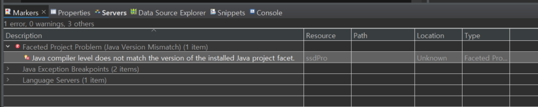
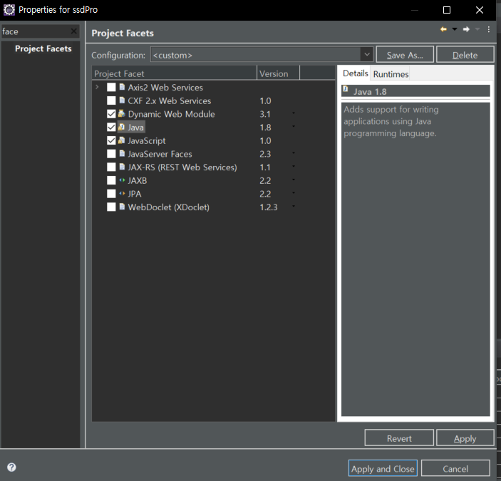
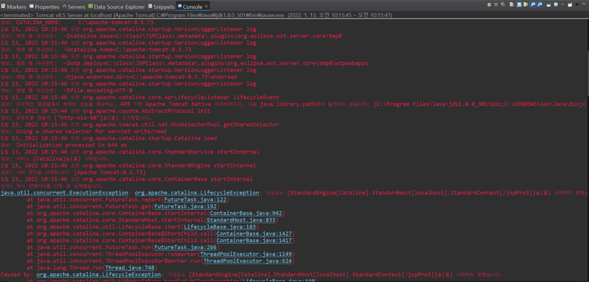
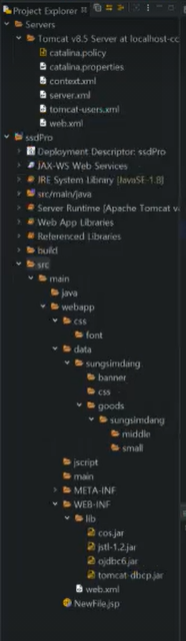

## 환경설정

1. 오라클 계정생성
2. 이클립스 프로젝트 생성
3. DBCP 연결
4. 


```sql
CREATE USER ssd
IDENTIFIED BY 1234;
```

**권한부여**

```sql
GRANT CONNECT, RESOURCE, DBA, UNLIMITED TABLESPACE 
TO ssd;
```

- `CONNECT`  SQL Developer 에 접속권한을 준다.


**계정의 테이블 모두 삭제**

```sql
SELECT  'DROP TABLE ' || object_name || ' CASCADE CONSTRAINTS;'
FROM    user_objects
WHERE   object_type = 'TABLE';
```


### DBCP

**emp 예시**

```jsp
<%@ page language="java" contentType="text/html; charset=UTF-8"
	pageEncoding="UTF-8"%>
<%@ taglib uri="http://java.sun.com/jsp/jstl/sql" prefix="sql" %>
<%@ taglib uri="http://java.sun.com/jsp/jstl/core" prefix="c" %>
<sql:query var="emps" dataSource="jdbc/myoracle">
SELECT * FROM emp
</sql:query>

<!DOCTYPE html>
<html>
<head>
<meta charset="UTF-8">
<title>Insert title here</title>
</head>
<body>
	<h3>Hello world3</h3>
	
	<c:forEach var="e" items="${emps.rows}">
	    empno ${e.empno}<br/>
	    ename ${e.ename}<br/>
	</c:forEach>	
</body>
</html>
```

### 경로수정

아래서버톰캣 더블클릭 - Modules 탭 - Edit 으로 수정

## 서블릿

form 태그의 `JoinOK` 와 servlet 의 `/ex/JoinOK` 를 연결한다.

forward 로 `joinOK.jsp` 로 연결한다.

혹은

form 태그의 `/jspPro3/JoinOK` 와 servlet 의 `/JoinOK` 를 연결한다.

forward 로 `ex/joinOK.jsp` 로 연결한다.


만약 경로를 `/` 로 바꿨다면 

form 태그의 `/JoinOK` 와 servlet 의 `/JoinOK` 를 연결한다.


## 에러

###  **메모리부족**


```
an out of memory error has occurred.
```


```
C:\Users\Connor\eclipse\jee-2021-092\eclipse\eclipse.ini
```

-xms256m

-xms256m

을 

512 와 1024로 각각 바꾼다.

해결된 것 같다.

### 컴파일러 



```
faceted project problem (java version mismatch)
```

프로젝트 우클릭 - properties - facet 검색 - 



java 를 컴파일러인 1.8 과 같게 맞춰준다.

## 에디터열림

이클립스에서 파일을 여니 외부 에디터로 열리는 문제

window - preferences - file associations 검색해서 - File types 에 `.asp` 를 추가하고 Associated editors 에 `java Editor (default)` 를 추가한다.


## 서버



```
java.util.concurrent.ExecutionException: org.apache.catalina.LifecycleException: 구성요소 [StandardEngine[Catalina].StandardHost[localhost].StandardContext[/jspPro3]]을(를) 시작하지 못했습니다.
```

web.xml 과 충돌났는지 본다.

서블릿 앞에 `/` 를 없애면 에러가 나는듯 하다.


## 기타

자바스크립트를 import 했을 때 왜 업데이트 안되지?


## 폴더구조




암호화: https://stricky.tistory.com/330


## 로그인&암호화

로그인: https://blog.naver.com/yejine98/222507002547

암호화: https://cafe.naver.com/javachobostudy/151748


# 회원

## 회원가입

### 아이디중복체크

ajax

- `serialize()` 와 dataType 이  `json`  로 주고받아야 한다.
- POST 방식은 getParameter 가 되지 않는다.
- 값을 돌려줄 때는 `response.getWriter().print()` 로 돌려준다.


**join.jsp**

```jsp
<script>
function idCheck2() {
	var userid = $("#chkID2").serialize();

	$.ajax({
		async : true,
		type : 'GET',
		data : userid,
		url : "/idcheck.do",
		dataType : "json",
		contentType : "application/json; charset=UTF-8",
		cache : false,
		success : function(data) {
			if (data == "0") {
				$("#checkId").prop("style", "color:blue").html("사용 가능한 ID 입니다.");
			} else {
				$("#checkId").prop("style", "color:red").html("사용 불가능한 아이디 입니다.");
			}
		},
		error : function(error) {
			console.log("error : " + error);
		}
	});
}
</script>										
```

파일을 따로 나눌 필요가 있다.


