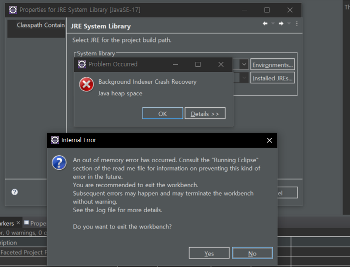

## 환경설정

1. 오라클 계정생성
2. 이클립스 프로젝트 생성
3. DBCP 연결
4. 


```sql
CREATE USER ssd
IDENTIFIED BY 1234;
```

**권한부여**

```sql
GRANT CONNECT, RESOURCE, DBA, UNLIMITED TABLESPACE 
TO ssd;
```

- `CONNECT`  SQL Developer 에 접속권한을 준다.


**계정의 테이블 모두 삭제**

```sql
SELECT  'DROP TABLE ' || object_name || ' CASCADE CONSTRAINTS;'
FROM    user_objects
WHERE   object_type = 'TABLE';
```


### DBCP

**emp 예시**

```jsp
<%@ page language="java" contentType="text/html; charset=UTF-8"
	pageEncoding="UTF-8"%>
<%@ taglib uri="http://java.sun.com/jsp/jstl/sql" prefix="sql" %>
<%@ taglib uri="http://java.sun.com/jsp/jstl/core" prefix="c" %>
<sql:query var="emps" dataSource="jdbc/myoracle">
SELECT * FROM emp
</sql:query>

<!DOCTYPE html>
<html>
<head>
<meta charset="UTF-8">
<title>Insert title here</title>
</head>
<body>
	<h3>Hello world3</h3>
	
	<c:forEach var="e" items="${emps.rows}">
	    empno ${e.empno}<br/>
	    ename ${e.ename}<br/>
	</c:forEach>	
</body>
</html>
```

### 경로수정

아래서버톰캣 더블클릭 - Modules 탭 - Edit 으로 수정

## 에러

###  **메모리부족**



```
an out of memory error has occurred.
```


```
C:\Users\Connor\eclipse\jee-2021-092\eclipse\eclipse.ini
```

-xms256m

-xms256m

을 

512 와 1024로 각각 바꾼다.

해결된 것 같다.

### 컴파일러 


```
faceted project problem (java version mismatch)
```

프로젝트 우클릭 - properties - facet 검색 - 


java 를 컴파일러인 1.8 과 같게 맞춰준다.


## 폴더구조


