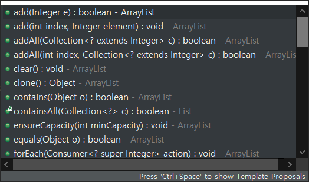
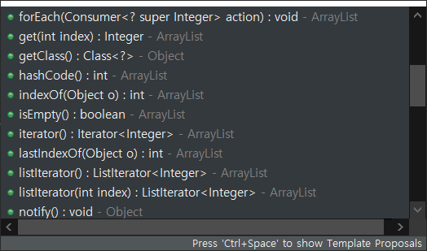
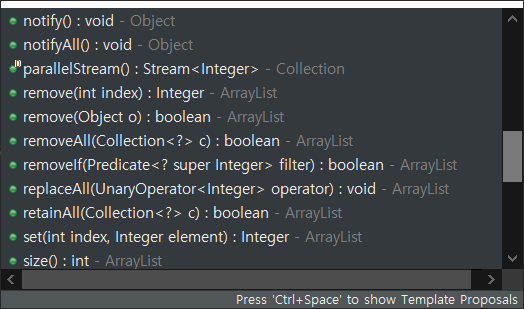
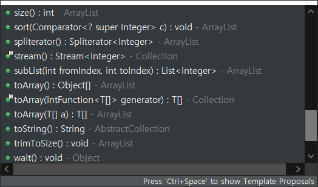

## Array

`Object[] arr = new Object[n]` 선언

`Object[] arr = {element1, element2, element3, element4}` 선언

`Array`

- `array[index] = element` add(), set()
- `array[index]` get()
- `.length` size()
- `.clone()` Array List 동일
- `.equals(Object)` Array List 동일
- `.toString()` 재정의가 필요하다.
- `.getClass()`
- `.hashCode()`
- `.notify()`
- `.notifyAll()`
- `.wait()`

## Array List

`ArrayList<Object> arr = new ArrayList<>()` 선언

`name = [element1, element2, element3, element4]` 선언

    

    

    

    

    

`ArrayList` Array 제외 함수

- `.add(element) or .add(index, element)` 값 추가
- `.addAll`
- `.set(index, element)` 값 변경
- `.get(index)` 값 반환
- `.remove(index)` 값 제거
- `.clear()` 모든 값 제거
- `.size()` 리스트 크기 반환
- `.indexOf(element)` 인덱스 반환
- `.lastIndexOf()` 
- `.isEmpty()` 비어있는지 boolean 반환
- `.contains(Object)` 
- `.containsAll()`
- `.ensureCapacity()`
- `.forEach()`
- `.iterator()`
- `.listIterator()`
- `.paralleleStream()`
- `.removeAll()`
- `.removeIf()`
- `.replaceAll()`
- `.sort()`
- `.spliterator()`
- `.stream()`
- `.subList()`
- `.toArray()`
- `.trimToSize()`

## Linked List

`LinkedList` Doubly Linked List : Array List 제외 함수

- `.addFirst(element)`
- `.addLast(element)` 
- `.getFirst()`
- `.getLast()`
- `.removeFirst()`
- `.removeLast()`
- `.removeFirstOccurrence()`
- `.removeLastOccurrence()`
- `.retainAll()`
- `.offerFirst()`
- `.offerLast()`
- `.peekFirst()`
- `.peekLast()`
- `.pollFirst()`
- `.pollLast()`
- `.pop()`
- `.push()`
- `.descendingIterator()`
- `.element()`

Array List 에 있는 `ensureCapacity` 와 `trimToSize` 가 없다.

## Hash Map

`HashMap<Object, Object> hash = new HashMap<>()` 선언

`HashMap` 

- `.clear()`
- `.clone()`
- `.equals()`
- `.forEach()`
- `.get()`
- `.getClass()`
- `.getOrDefault()`
- `.hashCode()`
- `.isEmpty()`
- `.notify()`
- `.notifyAll()`
- `.remove()`
- `.replace()`
- `.replaceAll()`
- `.size()`
- `.toString()`
- `.values()`
- `.wait()`
- `.compute()`
- `.computeIfAbsent()`
- `.computeIfPresent()`
- `.containsKey()`
- `.containsValue()`
- `.entrySet()`
- `.KeySet()`
- `.merge()`
- `.put()`
- `.putAll()`
- `.putIfAbsent()`

add, set, `indexOf`, iterator, stream, sort, `subList`, `tremToSize` 함수가 없습니다.

## Iterator

`Iterator<Object> iterator = arrList.iterator()`

`iterator`

- `.hasNext()` 
- `.next()`
- `.remove()`