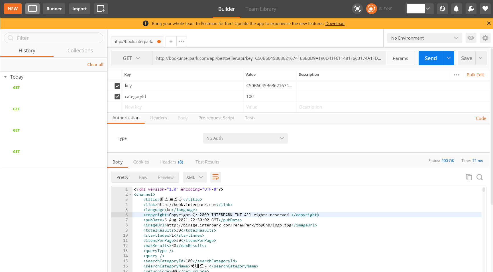
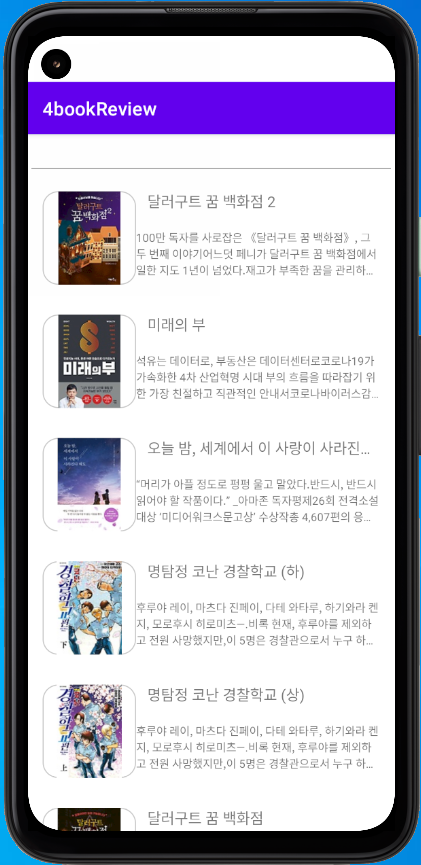
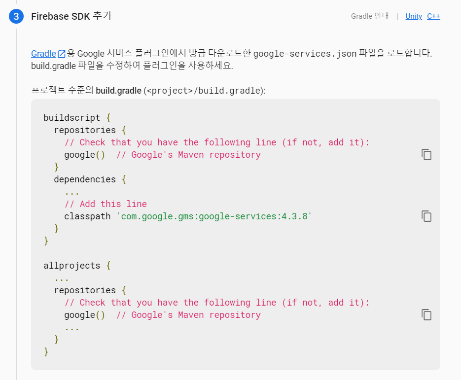

# 코틀린

1. 함수는 fun 으로 선언. 중괄호로 감싸도 되고 등호로 표현해도 된다.
2. 상수는 val, 변수는 var 타입추론이 가능하므로 타입선언이 꼭 필요하지 않다.
3. null 이 가능한 타입과 가능하지 않은 타입이 있다. 그래서 초기화가 있어야 한다.
4. Long 형은 L, Float 형은 f 를 끝에 붙인다.
5. until 이라는 키워드도 있다.
6. for-each 구문도 for (number in numberList){} 로 사용할 수 있다.
7. while 문과 do-while 문이 있다.
8. 자바와 다르게 Int 는 대문자로 시작한다.
9. swich 문이 없는 대신 when 문이 있다.

```kotlin
fun main() {
    for (i in 1..5) {
        print(i)  // 12345
    }
}
```

```kotlin
fun main() {
    for (i in 1..10 step 2) {
        print(i)  // 13579
    }
}
```

```kotlin
fun main() {
    for (i in 8 downTo 0 step 2) {
        print(i)  // 86420
    }
}
```

**if 문**

```kotlin
var max: Int
if (a > b) {
    max = a
} else {
    max = b
}
```

**간략한 코드:** 변수 = if 와 같이 사용할 수 있다.

```kotlin
var max = if (a > b) {
    a
} else {
    b
}
```

**when 문**

```kotlin
when (x) {
    1 -> print("x 는 1 입니다.")
    2 -> print("x 는 2 입니다")
    else -> print("x 는 1 도 2 도 아닙니다.")
}
```

**콤마 사용**

```kotlin
when (x) {
    1, 3 -> print("x 는 1 또는 3 입니다.")
    2 -> print("x 는 2 입니다")
    else -> print("x 는 1, 2, 3 이 아닙니다.")
	}
}
```

**in 사용**

```kotlin
when (x) {
    in 1..10 -> print("x 는 1 과 10 사이에 있습니다.")
    !in 11..20 -> print("x 는 11 과 20 사이에 없습니다.")
}
```

**is 사용**

```kotlin
when (x) {
    is Int -> print("x 는 정수입니다.")
    else -> print("x 는 정수가 아닙니다.")
}
```

자바의 **switch 문**

```java
int key = 1;

switch (key) {
case 1 -> System.out.print("x 는 1 입니다.");
case 2 -> System.out.print("x 는 2 입니다.");
default -> System.out.print("x 는 1 도 2 도 아닙니다.");
}
```

**자바와 코틀린 비교**

Null Safe

```kotlin
val b: Int? = 100  // null 이 가능
val c: Int = 100   // null 이 불가능
```

NullPointException 을 피하기 위해 안전한 코드를 사용해야 한다.

**안전한 코드**

```kotlin
b?.sum()  // null 일 경우 실행하지 않음
c.sum()   // 애초에 null safe 함
```

자바보다 간략하게 물음표 (?) 만 간단히 넣어 null safe 로 작성할 수 있다.

**Scope Function:** apply, with, let, also, run

| Function | Object reference | Return value   | Is extension function                       |                 |
| -------- | ---------------- | -------------- | ------------------------------------------- | --------------- |
| let      | lt               | Lambda result  | Yes                                         | if 문 null safe |
| run      | this             | Lambda result  | Yes                                         |                 |
| run      | -                | Lambda result  | No: called without the context object       |                 |
| with     | this             | Lambda result  | No: takes the context object as an argument | 객체 메서드     |
| apply    | this             | Context object | Yes                                         | 객체 초기화     |
| also     | lt               | Context object | Yes                                         |                 |

 **apply**

객체를 쉽게 초기화할 수 있다.

new 와 같은 객체 초기화 코드

```kotlin
val person = Person().apply {
    firstName = "Fast"
    lastName = "Campus"
}
```

**also**

```kotlin
Random.nextInt(100).also {
    println("값: $it")  // 값: 56
}
```

```kotlin
Random.nextInt(100).also { value ->
	print("값: $value")
}
```

**java 비교**

```java
int value = Random().nextInt(100);
System.out.print(value);
```

**let**

if 문의 null 확인을 간단히 쓸 수 있다.

null 이 아닌 객체에서 람다를 실행할 때 사용

```kotlin
val number: Int?
val sumNumberStr = number?.let {
    "${sum(10, it)}"
}
```

**java 비교**

```java
Integer number = null;
String sumNumberStr = null;

if (number != null) {
    sumNumberStr = "" + sum(10, number);
}
```


```kotlin
val number: Int?
val sumNumberStr = number?.let {
    "${sum(10, it)}"
}.orEmpty()
```

**java 비교**

```java
Integer number = null;
String sumNumberStr = null;

if (number != null) {
    sumNumberStr = "" + sum(10, number);
} else {
    sumNumberStr = "";
}
```

**with**

객체의 메서드를 한꺼번에 실행할 수 있다.

```kotlin
val person = Person()

with(person) {
    work()
    sleep()
    println(age)
}
```

**java 비교**

```java
Person person = new Person();

person.work();
person.sleep();
System.out.println(person.age);
```

**run**

setter 와 메소드의 반환 값을 변수에 저장을 동시에 실행한다.

확장함수로 사용할 수 있다.

```kotlin
val result = service.run {
    port = 8080
    query()
}
```

**java 비교**

```java
service.port = 8080;
Result result = service.query();
```

**Data Class**

생성자, getter, setter 를 한꺼번에 정의한다.

val 는 상수이므로 선언 시 setter 는 생성되지 않는다.

var 는 변수이므로 선언 시 setter 가 생성된다.

```kotlin
data class JavaObject(val s: String)
```

**java 비교**

```java
public class JavaObject {
    private String s;
    
    JavaObject(String s) {
        this.s = s;
    }
    
    public String getS() {
        return s;
    }
    
    public void setS(String s) {
        this.s = s;
    }
}
```

**Lambda expression**

```kotlin
button.setOnClickListener { v ->
                           
}
```

**java 비교**

```java
button.setOnClickListener(new View.OnClickListener() {
    @Override
    public void onClick(View v) {
        
    }
});
```

**late init, lazy init**

`lateinit` 후에 초기화 할 것이기 때문에 물음표 (?) 를 생략하고 사용한다.

```kotlin
var nullableNumber: Int? = null
lateinit var lateinitNumber: Int

lateinitNumber = 10

nullableNumber?.add()
lateinitNumber.add()
```

`lazyinit` 사용하는 순간에 변수에 값이 저장된다.

```kotlin
val lazyNumber :Int by lazy {
    100
}

lazyNumber.add()
```

코틀린 메뉴얼 사이트: <https://kotlinlang.org/>{:target="_blank"}

# 1-1. BMI 계산기 앱

**findViewById**

```kotlin
val editText: EditText = findViewById(R.id.editText)
```

**같은코드**

```kotlin
val editText = findViewById<EditText>(R.id.editText)
```

editText get: `editText.text.toString()` 	

# 3. Intermediate

## -4. 도서리뷰 앱

1. RecycleView
2. View Binding
3. Retrofit
4. Glide 사용
5. Android Room 사용: 계산기 앱
6. Open API 사용

**인터파크 API**

인증키 얻는 법

1. 마이북피니언
2. 관리
3. 오픈업(Open Up) 관리
4. 인증키 복사

API 메뉴얼: <http://book.interpark.com/blog/bookpinion/bookpinionOpenAPIInfo.rdo>{:target="_blank"}

### 포스트맨

오픈 API 의 데이터를 확인할 수 있는 플러그인

포스트맨 플러그인: <https://chrome.google.com/webstore/detail/postman/fhbjgbiflinjbdggehcddcbncdddomop/related?hl=ko>{:target="_blank"}

포스트맨 사용방법

1. 링크를 입력
2. params 를 눌러 key 와 value 입력
3. send 클릭



### 레프토핏

오픈 API 를 안드로이드에서 사용할 수 있게 도와주는 라이브러리

레트로핏 라이브러리: <https://square.github.io/retrofit>{:target="_blank"}

**인터파크 API 예시코드**

api 패키지와 model 패키지를 만든다.

**gradle**

```
/* 레트로핏 */
implementation 'com.squareup.retrofit2:retrofit:2.9.0'
implementation 'com.squareup.retrofit2:converter-gson:2.9.0'
```

**Manifest**

```
<uses-permission android:name="android.permission.INTERNET"/>
```

**MainActivity.kt**

```kotlin
class MainActivity : AppCompatActivity() {
    override fun onCreate(savedInstanceState: Bundle?) {
        super.onCreate(savedInstanceState)
        setContentView(R.layout.activity_main)

        val retrofit = Retrofit.Builder()
            .baseUrl("https://book.interpark.com")
            .addConverterFactory(GsonConverterFactory.create())
            .build()
        val bookService = retrofit.create(BookService::class.java)
        bookService.getBestSellerBooks("C50B6045B636216741E3B0D9A190D41F611481F663174A1FD443DA17DD8B5FDC")
            .enqueue(object: Callback<BestSellerDTO> {
                override fun onResponse(
                    call: Call<BestSellerDTO>,
                    response: Response<BestSellerDTO>,
                ) {
                    // todo 성공처리
                    if (response.isSuccessful.not()) {
                        Log.e(TAG, "Not!! Success")
                        return
                    }
                    response.body()?.let {
                        Log.d(TAG, it.toString())
                        it.books.forEach { book ->
                            Log.d(TAG, book.toString())
                        }
                    }
                }

                override fun onFailure(call: Call<BestSellerDTO>, t: Throwable) {
                    // todo 실패처리
                    Log.e(TAG, t.toString())
                }
            })
    }
    companion object {
        private const val TAG = "MainActivity"
    }
}
```

**BookService.kt** 인터페이스

```kotlin
interface BookService {
    @GET("/api/search.api?output=json")
    fun getBooksByName(
        @Query("key") apiKey: String,
        @Query("query") Keyword: String
    ): Call<SearchBookDTO>

    @GET("/api/bestSeller.api?categoryId=100&output=json")
    fun getBestSellerBooks(
        @Query("key") apiKey: String
    ): Call<BestSellerDTO>
}
```

**SearchBookDTO.kt**

> @SerializedName 는 꼭 없어도 됩니다.

```kotlin
data class SearchBookDTO(
    @SerializedName("title") val title: String,
    @SerializedName("item") val books: List<Book>
)
```

**BestSellerDTO.kt**

```kotlin
data class BestSellerDTO(
    @SerializedName("title") val title: String,
    @SerializedName("item") val books: List<Book>
)
```

**Book.kt**

```kotlin
data class Book(
    @SerializedName("itemId") val id: Long,
    @SerializedName("title") val title: String,
    @SerializedName("description") val description: String,
    @SerializedName("coverSmallUrl") val coverSmallUrl: String
)
```

### **리사이클러 뷰**

스크롤 뷰는 미리 모든 데이터가 보여주기 때문에 데이터가 많다면 느려지거나 꺼질 위험이 있다.

레이아웃매니저와 어댑터가 필요하다.

리스트어댑터는 import 를 recyclerview.widget.ListAdapter 를 할 것

**build.gradle(app)**

```
android {
    viewBinding {
        enabled = true
    }
}
```

**BookAdapter.kt**

```kotlin
class BookAdapter: ListAdapter<Book, BookAdapter.BookItemViewHolder>(diffUtil) {
    inner class BookItemViewHolder(private val binding: ItemBookBinding): RecyclerView.ViewHolder(binding.root) {
        fun bind(bookModel: Book) {
            binding.titleTextView.text = bookModel.title
        }
    }

    override fun onCreateViewHolder(parent: ViewGroup, viewType: Int): BookItemViewHolder {
        return BookItemViewHolder(ItemBookBinding.inflate(LayoutInflater.from(parent.context), parent, false))
    }

    override fun onBindViewHolder(holder: BookItemViewHolder, position: Int) {
        holder.bind(currentList[position])
    }

    companion object {
        val diffUtil = object: DiffUtil.ItemCallback<Book>() {
            override fun areItemsTheSame(oldItem: Book, newItem: Book): Boolean {
                return oldItem == newItem
            }

            override fun areContentsTheSame(oldItem: Book, newItem: Book): Boolean {
                return oldItem.id == newItem.id
            }
        }
    }
}
```

**MainActivity.kt**

onCreate 내부

```kotlin
binding = ActivityMainBinding.inflate(layoutInflater)
setContentView(binding.root)
adapter = BookAdapter()
binding.bookRecyclerView.layoutManager = LinearLayoutManager(this)
binding.bookRecyclerView.adapter = adapter
```

onResponse 내부

```kotlin
adapter.submitList(it.books)
```

**전체코드**

```kotlin
class MainActivity : AppCompatActivity() {
    private lateinit var adapter: BookAdapter
    private  lateinit var binding: ActivityMainBinding

    override fun onCreate(savedInstanceState: Bundle?) {
        super.onCreate(savedInstanceState)
        binding = ActivityMainBinding.inflate(layoutInflater)
        setContentView(binding.root)

        initBookRecyclerView() 

        val retrofit = Retrofit.Builder()
            .baseUrl("https://book.interpark.com")
            .addConverterFactory(GsonConverterFactory.create())
            .build()
        val bookService = retrofit.create(BookService::class.java)
        bookService.getBestSellerBooks("C50B6045B636216741E3B0D9A190D41F611481F663174A1FD443DA17DD8B5FDC")
            .enqueue(object: Callback<BestSellerDTO> {
                override fun onResponse(
                    call: Call<BestSellerDTO>,
                    response: Response<BestSellerDTO>,
                ) {
                    // todo 성공처리
                    if (response.isSuccessful.not()) {
                        Log.e(TAG, "Not!! Success")
                        return
                    }
                    response.body()?.let {
                        Log.d(TAG, it.toString())
                        it.books.forEach { book ->
                            Log.d(TAG, book.toString())
                        }
                        adapter.submitList(it.books)
                    }
                }

                override fun onFailure(call: Call<BestSellerDTO>, t: Throwable) {
                    // todo 실패처리
                    Log.e(TAG, t.toString())
                }
            })
    }

    fun initBookRecyclerView() {
        adapter = BookAdapter()
        binding.bookRecyclerView.layoutManager = LinearLayoutManager(this)
        binding.bookRecyclerView.adapter = adapter
    }

    companion object {
        private const val TAG = "MainActivity"
    }
}
```

**Glide**

이미지 URL 을 이미지로 받아와주는 라이브러리

```
dependencies {
  implementation 'com.github.bumptech.glide:glide:4.12.0'
}
```

링크: <https://github.com/bumptech/glide>{:target="_blank"}

**최종**



**background_gray_stroke_radius_16** drawable.xml

```xml
<shape xmlns:android="http://schemas.android.com/apk/res/android"
    android:shape="rectangle">
    <stroke
        android:width="1dp"
        android:color="@color/gray">
    </stroke>
    <corners android:radius="16dp"/>
</shape>
```

**Manifest**

http 통신을 허용한다.

```
android:usesCleartextTraffic="true"
```

**BookAdapter.kt**

bind 함수에 추가한다.

```kotlin
fun bind(bookModel: Book) {
    binding.titleTextView.text = bookModel.title
    binding.descriptionTextView.text = bookModel.description
    Glide
        .with(binding.coverImageView.context)
        .load(bookModel.coverSmallUrl)
        .into(binding.coverImageView)
}
```

**item_book.xml**

```xml
<androidx.constraintlayout.widget.ConstraintLayout xmlns:android="http://schemas.android.com/apk/res/android"
    xmlns:app="http://schemas.android.com/apk/res-auto"
    xmlns:tools="http://schemas.android.com/tools"
    android:layout_width="match_parent"
    android:layout_height="wrap_content"
    android:orientation="vertical"
    android:padding="16dp">

    <ImageView
        android:id="@+id/coverImageView"
        app:layout_constraintStart_toStartOf="parent"
        app:layout_constraintTop_toTopOf="parent"
        app:layout_constraintBottom_toBottomOf="parent"
        android:layout_width="100dp"
        android:layout_height="100dp"
        android:background="@drawable/background_gray_stroke_radius_16">
    </ImageView>

    <TextView
        android:id="@+id/titleTextView"
        android:layout_width="0dp"
        android:layout_height="wrap_content"
        android:layout_marginLeft="12dp"
        android:ellipsize="end"
        android:lines="1"
        android:text="안드로이드 마스터하기"
        android:textSize="16dp"
        app:layout_constraintStart_toEndOf="@id/coverImageView"
        app:layout_constraintTop_toTopOf="parent"
        app:layout_constraintEnd_toEndOf="parent">
    </TextView>

    <TextView
        android:id="@+id/descriptionTextView"
        android:layout_width="0dp"
        android:layout_height="wrap_content"
        android:layout_marginTop="12dp"
        android:ellipsize="end"
        android:maxLines="3"
        android:textSize="12dp"
        app:layout_constraintBottom_toBottomOf="parent"
        app:layout_constraintEnd_toEndOf="parent"
        app:layout_constraintStart_toEndOf="@id/coverImageView"
        app:layout_constraintTop_toBottomOf="@id/titleTextView">
    </TextView>
</androidx.constraintlayout.widget.ConstraintLayout>
```

**한 줄에 표시되고 넘으면 ... 붙이기**

```xml
android:lines="1"
android:ellipsize="end"
```

**전체코드** BookAdapter.kt

```kotlin
class BookAdapter: ListAdapter<Book, BookAdapter.BookItemViewHolder>(diffUtil) {
    inner class BookItemViewHolder(private val binding: ItemBookBinding): RecyclerView.ViewHolder(binding.root) {
        fun bind(bookModel: Book) {
            binding.titleTextView.text = bookModel.title
            binding.descriptionTextView.text = bookModel.description
            Glide
                .with(binding.coverImageView.context)
                .load(bookModel.coverSmallUrl)
                .into(binding.coverImageView)
        }
    }

    override fun onCreateViewHolder(parent: ViewGroup, viewType: Int): BookItemViewHolder {
        return BookItemViewHolder(ItemBookBinding.inflate(LayoutInflater.from(parent.context), parent, false))
    }

    override fun onBindViewHolder(holder: BookItemViewHolder, position: Int) {
        holder.bind(currentList[position])
    }

    companion object {
        val diffUtil = object: DiffUtil.ItemCallback<Book>() {
            override fun areItemsTheSame(oldItem: Book, newItem: Book): Boolean {
                return oldItem == newItem
            }

            override fun areContentsTheSame(oldItem: Book, newItem: Book): Boolean {
                return oldItem.id == newItem.id
            }
        }
    }
}
```

## -5. 틴더 앱

1. 파이어베이스 로그인
2. 파이어베이스 데이터베이스

**파이어베이스 환경설정**

파이어베이스: <https://firebase.google.com/?hl=ko>{:target="_blank"}

**앱 등록**

1. 패키지명 입력
2. json 파일 app 폴더 내에 붙여넣기
3. build.gradle (Project) 내에 붙여넣기
4. build.gradle (App) 내에 붙여넣기



일반적인 경우 

```
classpath 'com.google.gms:google-services:4.3.8'
```

이 코드만 추가하면 된다.

마찬가지로 build.gradle (App) 내에도 화면에 나오는 코드를 넣으면 된다.

```
id 'com.google.gms.google-services'

dependencies {
	implementation 'com.google.firebase:firebase-bom:28.3.0'
}
```

두 코드를 각각 넣으면 된다.

**구글로그인**

메뉴얼: <https://firebase.google.com/docs/auth/android/google-signin>{:target="_blank"}

1. SDK 추가
2. Authentication 에서 구글로그인을 누르고 사용설정 - 프로젝트 지원 이메일을 선택 후 저장한다.
3. GoogleSignInActivity.kt 클래스 파일을 받아 java 디렉토리에 저장

**GoogleSignInActivity**

```kotlin
/**
 * Demonstrate Firebase Authentication using a Google ID Token.
 */
class GoogleSignInActivity : Activity() {

    // [START declare_auth]
    private lateinit var auth: FirebaseAuth
    // [END declare_auth]

    private lateinit var googleSignInClient: GoogleSignInClient

    override fun onCreate(savedInstanceState: Bundle?) {
        super.onCreate(savedInstanceState)

        /* 1. GoogleSignInOptions 객체를 구성할 때 requestIdToken을 호출합니다. */
        // [START config_signin]
        // Configure Google Sign In
        val gso = GoogleSignInOptions.Builder(GoogleSignInOptions.DEFAULT_SIGN_IN)
                .requestIdToken(getString(R.string.default_web_client_id))
                .requestEmail()
                .build()

        googleSignInClient = GoogleSignIn.getClient(this, gso)
        // [END config_signin]


        /* 2. 다음과 같이 로그인 작업의 onCreate 메서드에서 FirebaseAuth 객체의 공유 인스턴스를 가져옵니다. */
        // [START initialize_auth]
        // Initialize Firebase Auth
        auth = Firebase.auth
        // [END initialize_auth]
    }

    /* 3. 활동을 초기화할 때 사용자가 현재 로그인되어 있는지 확인합니다. */
    // [START on_start_check_user]
    override fun onStart() {
        super.onStart()
        // Check if user is signed in (non-null) and update UI accordingly.
        val currentUser = auth.currentUser
        updateUI(currentUser)
    }
    // [END on_start_check_user]

    // [START onactivityresult]
    override fun onActivityResult(requestCode: Int, resultCode: Int, data: Intent?) {
        super.onActivityResult(requestCode, resultCode, data)

        // Result returned from launching the Intent from GoogleSignInApi.getSignInIntent(...);
        if (requestCode == RC_SIGN_IN) {
            val task = GoogleSignIn.getSignedInAccountFromIntent(data)
            try {
                // Google Sign In was successful, authenticate with Firebase
                val account = task.getResult(ApiException::class.java)!!
                Log.d(TAG, "firebaseAuthWithGoogle:" + account.id)
                firebaseAuthWithGoogle(account.idToken!!)
            } catch (e: ApiException) {
                // Google Sign In failed, update UI appropriately
                Log.w(TAG, "Google sign in failed", e)
            }
        }
    }
    // [END onactivityresult]

    /*
    * 4. 사용자가 정상적으로 로그인하면 GoogleSignInAccount 객체에서 ID 토큰을
    * 가져와서 Firebase 사용자 인증 정보로 교환하고 해당 정보를 사용해 Firebase에 인증합니다.
    */
    // [START auth_with_google]
    private fun firebaseAuthWithGoogle(idToken: String) {
        val credential = GoogleAuthProvider.getCredential(idToken, null)
        auth.signInWithCredential(credential)
                .addOnCompleteListener(this) { task ->
                    if (task.isSuccessful) {
                        // Sign in success, update UI with the signed-in user's information
                        Log.d(TAG, "signInWithCredential:success")
                        val user = auth.currentUser
                        updateUI(user)
                    } else {
                        // If sign in fails, display a message to the user.
                        Log.w(TAG, "signInWithCredential:failure", task.exception)
                        updateUI(null)
                    }
                }
    }
    // [END auth_with_google]

    // [START signin]
    private fun signIn() {
        val signInIntent = googleSignInClient.signInIntent
        startActivityForResult(signInIntent, RC_SIGN_IN)
    }
    // [END signin]

    private fun updateUI(user: FirebaseUser?) {
    }

    companion object {
        private const val TAG = "GoogleActivity"
        private const val RC_SIGN_IN = 9001
    }
}
```

**에러**

`default_web_client_id` 값을 못찾는 경우 실행을 해보면 gradle 에 의해 자동으로 생성된다.

**로그아웃**

```kotlin
Firebase.auth.signOut()
```

**계정데이터**

```kotlin
Firebase.auth.currentUser
```

**버튼**

SignInButton 이라고 검색하면 버튼이 이미 만들어져 있다.

```xml
<com.google.android.gms.common.SignInButton
    android:id="@+id/btn_googleSignIn"
    android:layout_width="wrap_content"
    android:layout_height="wrap_content"
    app:layout_constraintBottom_toBottomOf="parent"
    app:layout_constraintEnd_toEndOf="parent"
    app:layout_constraintStart_toStartOf="parent"
    app:layout_constraintTop_toTopOf="parent">
</com.google.android.gms.common.SignInButton>
```

**로그인**

```kotlin
signIn()
```

**7. 스와이프 애니메이션**

CardItem.kt

```kotlin
data class CardItem(
    val userId: String,
    val name: String
)
```

**activity_like.xml**

```xml
<com.yuyakaido.android.cardstackview.CardStackView
    android:id="@+id/cardStackView"
    android:layout_width="match_parent"
    android:layout_height="300dp"
    app:layout_constraintTop_toTopOf="parent"
    app:layout_constraintBottom_toBottomOf="parent"
    app:layout_constraintStart_toStartOf="parent"
    app:layout_constraintEnd_toEndOf="parent">
</com.yuyakaido.android.cardstackview.CardStackView>
```

**LikeActivity.kt**

```kotlin
class LikeActivity : AppCompatActivity(), CardStackListener {
    private val adapter = CardItemAdapter()
    private val cardItems = mutableListOf<CardItem>()

    private var auth: FirebaseAuth = Firebase.auth
    private lateinit var userDB: DatabaseReference

    override fun onCreate(savedInstanceState: Bundle?) {
        super.onCreate(savedInstanceState)
        setContentView(R.layout.activity_like)

        val text_name = findViewById<TextView>(R.id.text_name)
        userDB = Firebase.database.reference.child("Users")
        val currentUserDB = userDB.child(getCurrentUserID())
        currentUserDB.addListenerForSingleValueEvent(object: ValueEventListener {
            override fun onDataChange(snapshot: DataSnapshot) {	
                if (snapshot.child("name").value == null) {
                    showNameInputPopup()
                    return
                }
                getUnselectedUsers()
                // todo 유저정보를 갱신해라.
            }
            override fun onCancelled(error: DatabaseError) {
                TODO("Not yet implemented")
            }
        })

        initCardStackView()

        val like_logout = findViewById<Button>(R.id.like_logout)
        like_logout.setOnClickListener {
            auth.signOut()
            if (auth.currentUser == null) {
                startActivity(Intent(this, GoogleSignInActivity::class.java))
            }
        }
    }

    private fun initCardStackView() {
        val cardStackView = findViewById<CardStackView>(R.id.cardStackView)
        cardStackView.layoutManager = CardStackLayoutManager(this, this)
        cardStackView.adapter = adapter
    }

    private fun getUnselectedUsers() {
        userDB.addChildEventListener(object: ChildEventListener {
            override fun onChildAdded(snapshot: DataSnapshot, previousChildName: String?) {
                if (snapshot.child("userId").value != getCurrentUserID()
                    && snapshot.child("likeBy").child("like").hasChild(getCurrentUserID()).not()
                    && snapshot.child("likeBy").child("dislike").hasChild(getCurrentUserID()).not()) {

                    val userId = snapshot.child("userId").value.toString()
                    var name = "undecided"
                    if (snapshot.child("name").value != null) {
                        name = snapshot.child("name").value.toString()
                    }
                }
            }

            override fun onChildChanged(snapshot: DataSnapshot, previousChildName: String?) {
                TODO("Not yet implemented")
            }

            override fun onChildRemoved(snapshot: DataSnapshot) {
                TODO("Not yet implemented")
            }

            override fun onChildMoved(snapshot: DataSnapshot, previousChildName: String?) {
                TODO("Not yet implemented")
            }

            override fun onCancelled(error: DatabaseError) {
                TODO("Not yet implemented")
            }
            })
    }

    private fun showNameInputPopup() {
        val editText = EditText(this)

        AlertDialog.Builder(this)
            .setTitle("이름을 입력해주세요.")
            .setView(editText)
            .setPositiveButton("저장") { _, _ ->
                if (editText.text.isEmpty()) {
                    showNameInputPopup()
                } else {
                    saveUserName(editText.text.toString())
                }
            }
            .setCancelable(false)
            .show()
    }

    private fun saveUserName(name: String) {
        val userId = getCurrentUserID()
        val currentUserDB = userDB.child(userId)
        val user = mutableMapOf<String, Any>()
        user["userId"] = userId
        user["name"] = name
        currentUserDB.updateChildren(user)
    }

    private fun getCurrentUserID(): String {
        if (auth.currentUser == null) {
            Toast.makeText(this, "로그인이 되어있지 않습니다.", Toast.LENGTH_SHORT).show()
        }
        return auth.currentUser?.uid.orEmpty()
    }

    override fun onCardDragging(direction: Direction?, ratio: Float) {
        TODO("Not yet implemented")
    }

    override fun onCardSwiped(direction: Direction?) {
        TODO("Not yet implemented")
    }

    override fun onCardRewound() {
        TODO("Not yet implemented")
    }

    override fun onCardCanceled() {
        TODO("Not yet implemented")
    }

    override fun onCardAppeared(view: View?, position: Int) {
        TODO("Not yet implemented")
    }

    override fun onCardDisappeared(view: View?, position: Int) {
        TODO("Not yet implemented")
    }
}
```

Q. addListenerForSingleValueEvent, ValueEventListener, onDataChange & addChildEventListener, ChildEventListener, onChildAdded?

A. 파이어베이스에서 데이터를 읽는 세가지 방법입니다.

- \- addListenerForSingleValueEvent: 한 번만 호출되고 즉시 삭제되는 콜백이 필요한 경우에 사용.

\- 한 번 로드된 후 자주 변경되지 않거나 능동적으로 수신 대기할 필요가 없는 데이터에 유용

\- 이 메소드는 한번 호출된 후 다시 호출되지 않는다.

예) 이후에 변경되지 않는 UI 요소를 초기화할 때, 블로깅 앱에서 새 게시물을 작성하기 시작할 때 이 메소드로 사용자의 프로필을 로드

- addChildEventListener: \- 목록을 다루는 애플리케이션은 단일 개체에 사용되는 값 이벤트보다는 하위 이벤트를 수신 대기해야 합니다.

\- 하위 항목에 push() 메소드를 통해 새로 추가되거나, updateChildren() 메소드를 통해 업데이트 되는 경우가 그 예입니다.

\- 이 메소드는 데이터베이스의 특정한 노드에 대한 변경을 수신 대기하는데 유용할 수 있습니다.

- addValueEventListener() 메소드를 이용하여 DatabaseReference에 ValueEventListener를 추가

 \- 경로의 전체 내용에 대한 변경 사항을 읽고 수신 대기합니다.


출처: https://stack07142.tistory.com/282 [Hello World]

출처: https://stack07142.tistory.com/282 [Hello World]


출처: https://stack07142.tistory.com/282 [Hello World]

**CardItemAdapter**

```kotlin
class CardItemAdapter: ListAdapter<CardItem, CardItemAdapter.ViewHolder>(diffUtil) {

    inner class ViewHolder(private val view: View): RecyclerView.ViewHolder(view) {
        fun bind(cardItem: CardItem) {
            view.findViewById<TextView>(R.id.text_name).text = cardItem.name
        }
    }

    override fun onCreateViewHolder(parent: ViewGroup, viewType: Int): ViewHolder {
        val inflater = LayoutInflater.from(parent.context)
        return ViewHolder(inflater.inflate(R.layout.item_card, parent, false))
    }

    override fun onBindViewHolder(holder: ViewHolder, position: Int) {
        holder.bind(currentList[position])
    }

    companion object {
        val diffUtil = object : DiffUtil.ItemCallback<CardItem>() {
            override fun areItemsTheSame(oldItem: CardItem, newItem: CardItem): Boolean {
                return oldItem.userId == newItem.userId
            }

            override fun areContentsTheSame(oldItem: CardItem, newItem: CardItem): Boolean {
                return oldItem == newItem
            }

        }
    }
}
```

**item_card.xml**

```xml
<androidx.cardview.widget.CardView xmlns:android="http://schemas.android.com/apk/res/android"
    android:layout_width="match_parent"
    xmlns:app="http://schemas.android.com/apk/res-auto"
    android:layout_margin="24dp"
    app:cardCornerRadius="16dp"
    android:layout_height="match_parent">

    <LinearLayout
        android:background="#FFC107"
        android:layout_width="match_parent"
        android:layout_height="match_parent"
        android:gravity="center"
        android:orientation="vertical">

        <TextView
            android:id="@+id/text_name"
            android:text="name"
            android:textSize="40dp"
            android:layout_width="wrap_content"
            android:layout_height="wrap_content">
        </TextView>
    </LinearLayout>
</androidx.cardview.widget.CardView>
```

**최종**

```kotlin
class LikeActivity : AppCompatActivity(), CardStackListener {
    private val adapter = CardItemAdapter()
    private val cardItems = mutableListOf<CardItem>()

    private var auth: FirebaseAuth = Firebase.auth
    private lateinit var userDB: DatabaseReference

    private val manager by lazy {
        CardStackLayoutManager(this, this)
    }

    override fun onCreate(savedInstanceState: Bundle?) {
        super.onCreate(savedInstanceState)
        setContentView(R.layout.activity_like)

        val text_name = findViewById<TextView>(R.id.text_name)
        userDB = Firebase.database.reference.child("Users")
        val currentUserDB = userDB.child(getCurrentUserID())

        /* 이름 등록 */
        currentUserDB.addListenerForSingleValueEvent(object: ValueEventListener {
            override fun onDataChange(snapshot: DataSnapshot) {
                if (snapshot.child("name").value == null) {
                    showNameInputPopup()
                    return
                }
                getUnselectedUsers()
                // todo 유저정보를 갱신해라.
            }
            override fun onCancelled(error: DatabaseError) {
                TODO("Not yet implemented")
            }
        })

        initCardStackView()

        /* 로그아웃 버튼 */
        val like_logout = findViewById<Button>(R.id.like_logout)
        like_logout.setOnClickListener {
            auth.signOut()
            if (auth.currentUser == null) {
                startActivity(Intent(this, GoogleSignInActivity::class.java))
            }
        }
    }

    /* 메소드 시작 */

    /* 이름등록 팝업 */
    private fun showNameInputPopup() {
        val editText = EditText(this)

        AlertDialog.Builder(this)
            .setTitle("이름을 입력해주세요.")
            .setView(editText)
            .setPositiveButton("저장") { _, _ ->
                if (editText.text.isEmpty()) {
                    showNameInputPopup()
                } else {
                    saveUserName(editText.text.toString())
                }
            }
            .setCancelable(false)
            .show()
    }

    private fun saveUserName(name: String) {
        val userId = getCurrentUserID()
        val currentUserDB = userDB.child(userId)
        val user = mutableMapOf<String, Any>()
        user["userId"] = userId
        user["name"] = name
        currentUserDB.updateChildren(user)
    }

    private fun getCurrentUserID(): String {
        if (auth.currentUser == null) {
            Toast.makeText(this, "로그인이 되어있지 않습니다.", Toast.LENGTH_SHORT).show()
        }
        return auth.currentUser?.uid.orEmpty()
    }

    /* 카드스택 뷰 보여주기 */
    private fun initCardStackView() {
        val cardStackView = findViewById<CardStackView>(R.id.cardStackView)
        cardStackView.layoutManager = manager
        cardStackView.adapter = adapter
    }

    private fun getUnselectedUsers() {
        userDB.addChildEventListener(object: ChildEventListener {
            override fun onChildAdded(snapshot: DataSnapshot, previousChildName: String?) {
                if (snapshot.child("userId").value != getCurrentUserID()
                    && snapshot.child("likeBy").child("like").hasChild(getCurrentUserID()).not()
                    && snapshot.child("likeBy").child("dislike").hasChild(getCurrentUserID()).not()) {

                    val userId = snapshot.child("userId").value.toString()
                    var name = "undecided"
                    if (snapshot.child("name").value != null) {
                        name = snapshot.child("name").value.toString()
                    }

                    cardItems.add(CardItem(userId, name))
                    adapter.submitList(cardItems)
                    adapter.notifyDataSetChanged()
                }
            }

            override fun onChildChanged(snapshot: DataSnapshot, previousChildName: String?) {
                cardItems.find { it.userId == snapshot.key }?.let {
                    it.name = snapshot.child("name").value.toString()
                }
                adapter.submitList(cardItems)
                adapter.notifyDataSetChanged()
            }

            override fun onChildRemoved(snapshot: DataSnapshot) {
            }

            override fun onChildMoved(snapshot: DataSnapshot, previousChildName: String?) {
            }

            override fun onCancelled(error: DatabaseError) {
            }
        })
    }

    override fun onCardDragging(direction: Direction?, ratio: Float) {
    }

    override fun onCardSwiped(direction: Direction?) {
        when (direction) {
            Direction.Left -> like()
            Direction.Right -> dislike()
            else -> {
            }
        }
    }

    private fun like() {
        val card = cardItems[manager.topPosition - 1]
        cardItems.removeFirst()
        userDB.child(card.userId)
            .child("likeby")
            .child("like")
            .child(getCurrentUserID())
            .setValue(true)

        // todo 매칭이 된 시점을 봐야한다.

        Toast.makeText(this, "${card.name}님을 Like 하셨습니다.", Toast.LENGTH_SHORT).show()
    }

    private fun dislike() {
        val card = cardItems[manager.topPosition - 1]
        cardItems.removeFirst()
        userDB.child(card.userId)
            .child("likeby")
            .child("dislike")
            .child(getCurrentUserID())
            .setValue(false)

        Toast.makeText(this, "${card.name}님을 Dislike 하셨습니다.", Toast.LENGTH_SHORT).show()
    }

    override fun onCardRewound() {
    }

    override fun onCardCanceled() {
    }

    override fun onCardAppeared(view: View?, position: Int) {
    }

    override fun onCardDisappeared(view: View?, position: Int) {
    }
}
```

# 4-1. 유튜브 앱

1. 모션 레이아웃
2. ExoPlayer 
3. Youtube

ExoPlayer: 구글에서 만든 라이브러리. 내장되어 있지 않고 오픈소스이다.

메뉴얼: <https://exoplayer.dev/>{:target="_blank"}

# 5. Advanced

## -1. Todo 앱

1. MVP, MVVM, 구글아키텍쳐
2. DI 소개, Koin 사용
3. 시나리오 기반 TDD 코드 작성
4. ToDo 리스트, 상세화면 구현

## -4. SNS 앱

중고거래 앱의 개선

1. 파이어베이스 스토리지
2. 중고거래 앱 UI 수정
3. 카메라 기능 연결
4. 복수의 이미지 업로드 구현
5. 갤러리 기능 구현

